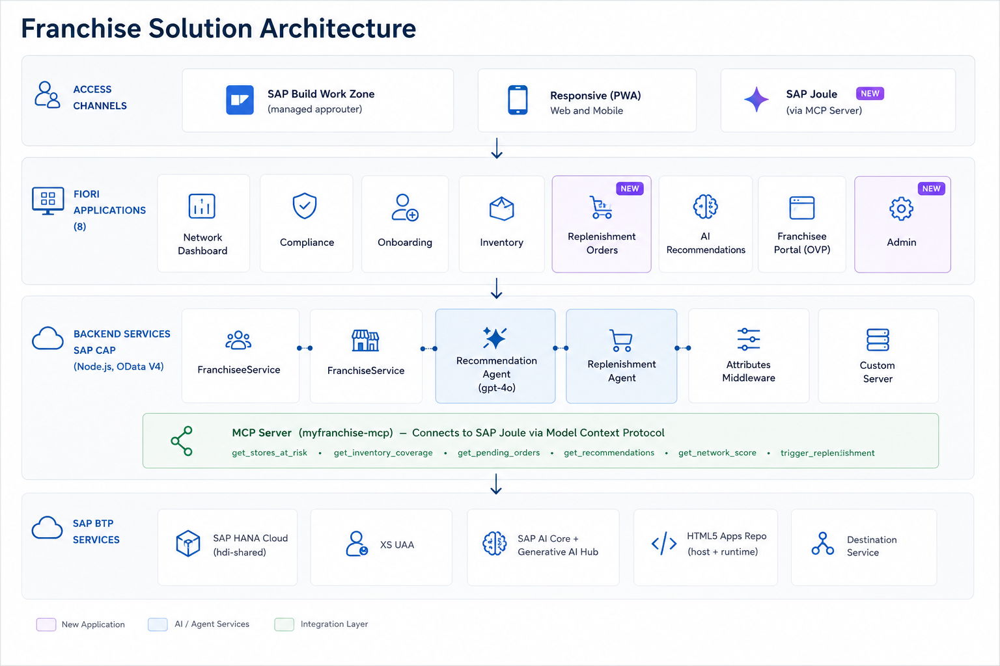

# RunMyFranchise

[🇧🇷 Português](README.md) · **🇬🇧 English**

> **SAP BTP solution for franchise network management**
> Dragons' Den: Learn to Win Edition 2026 — SAP Solution Advisory

---

## Overview

**Problem:** Franchisors struggle to manage and expand networks in a standardized way. Information is scattered, compliance is manual, KPIs arrive with delays, and franchisees operate as islands — with no visibility into their own performance and no proactive guidance.

**Solution:** An SAP BTP platform that connects franchisors and franchisees in real time: executive network panel, automatic compliance, AI agents for recommendations and inventory replenishment, an autonomous event broker (AEM), and a franchisee portal with its own dashboard.

**Anchor persona:** Franchisor Manager — Operations Director, network of 300 fashion/lifestyle stores (R$ 177–179M/quarter), wants to double the network without multiplying the chaos.

---

## Focus Scenario — Inventory Stockout

Inventory stockout is one of the key operational risks in franchise networks: out-of-stock products cause lost sales, franchisee dissatisfaction, and brand damage. The differentiator lies in **anticipating** the stockout by factoring in regional seasonality — the same replenishment strategy does not work for all regions.

**Demo with real data (July — reference month):**

| Store | Region | SKU | Coverage (Jul) | Status |
|---|---|---|---|---|
| Recife (u178) | NE | Sandália Feminina (MR550053) | 2.6 days | STOCKOUT |
| Salvador (u156) | NE | Sandália Feminina (MR550053) | 1.8 days | STOCKOUT |
| Porto Alegre (u147) | S | Sandália Feminina (MR550053) | 66.7 days | OK |
| Porto Alegre (u147) | S | Calça Jeans Masculina (MR550061) | 1.8 days | STOCKOUT |

Same product, same month → opposite risk by region. The agent calculates coverage with the regional seasonal factor and generates replenishment orders with gpt-4o justification, also considering the promotional calendar.

**Color×Size Grid:** 2,022 stock items with 117 STOCKOUT distributed across 8 products × colors × sizes.

**Substitutes:** 17 product substitute mappings for the "If X → Offer Y" guide (available via Joule `get_substitutos`).

> **Demo scenario:** the inventory stockout case is the main focus of the August 26 demonstration. Other scenarios (compliance, AI recommendations, category performance) may be included based on team analysis.

### Demo Flow

The central flow is **stockout rupture management** — from AI detection to Joule approval and confirmed replenishment. See `teste/ROTEIRO_DEMO.md` for the full script with pre-demo checklist.

---

## Competition Context

| Item | Detail |
|---|---|
| Event | Dragons' Den: Learn to Win Edition 2026 |
| Organization | SAP Solution Advisory |
| Format | 15-min live demo + 5-min Q&A |
| Date | August 26, 2026 |
| Critical requirement | Live demo, no screenshots |
| Highest-weight criterion | Live Demo Quality (20%) |

---

## Project Status

**Deployed to production** — SAP BTP Cloud Foundry, org `sa-build-platform-org / DEV`, region `us10`.

| Component | Status |
|---|---|
| CAP Backend + HANA Cloud + XSUAA | Production |
| AI Core + GenAI Hub (gpt-4o) | Production |
| Executive Home (OVP — 4 cards) | Production |
| Network Overview (ALP — health scores, donut, bar chart by region) | Production |
| Governance & Compliance (LROP Desvios) | Production |
| Category Performance (LROP KPI_Categoria — Beauty/Fashion/Accessories) | Production |
| Franchisor Dashboard (SAC Overview — iFrame story) | Production |
| Franchisee Portal (OVP — 8 cards) | Production |
| Network Stock Monitor (LROP — Color×Size grid, 14d forecast) | Production |
| Replenishment Approvals (LROP — AI agent orders) | Production |
| Demo Control Panel (simularVendas, resetarDemo, simularRecebimento) | Production |
| Joule MCP Server Node.js (11 tools, direct HANA) | Production |
| Dynamic KPI tiles (stockout + pending) | Production |
| SAP Advanced Event Mesh (AEM) — pub/sub broker | Production |
| Autonomous Replenishment Loop — startup scan + event-driven agent | Production |
| SAP RPT Predictive App | Production — `myfranchise-rpt.cfapps.us10.hana.ondemand.com` |
| Level-3 agent (auto-approval via BPA) | Post-demo — future: SAP BPA + IS iFlow as AEM consumer |

**Backend:** `https://sa-build-platform-org-dev-myfranchise-srv.cfapps.us10.hana.ondemand.com`

---

## SAP BTP Architecture



---

## Modules (9 HTML5 apps + Joule)

### 1. Executive Home (`home`)
- **Floorplan:** Overview Page (OVP) — 4 cards
- **Cards:** Network Revenue, Today's Highlights, Recent Activities, Network KPIs
- **Highlight:** Consolidated executive view of the network. Entry point of the demo for the franchisor manager.

### 2. Network Overview (`network`)
- **Floorplan:** Analytical List Page (ALP)
- **contextPath:** `/Saude_Dashboard`
- **Highlight:** Health scores per unit with criticality donut (Critical/Warning/Healthy), `emReforma` flag, bar chart by region. Filter by cluster/region. Drill-down to `/Unidades`.

### 3. Governance & Compliance (`compliance`)
- **Floorplan:** List Report + Object Page (LROP)
- **contextPath:** `/Desvios`
- **Highlight:** Automatic deviation detection in `after CREATE VendaPraticada`. Color-coded severity (HIGH red, MEDIUM yellow). Filters by store, period, and severity.

### 4. Category Performance (`categories`)
- **Floorplan:** List Report + Object Page (LROP)
- **contextPath:** `/KPI_Categoria`
- **Highlight:** Margins by sub-category (Beauty / Fashion / Accessories). 396 rows covering 3 categories × 22 stores × 6 periods.

### 5. Franchisor Dashboard (`sac-overview`)
- **Floorplan:** Custom UI5 with iFrame embed
- **semanticObject/action:** `SACOverview` / `display`
- **Highlight:** Renders the `FlowLayoutPanel_1` panel from the story `RunMyFranchise — Network Overview` directly in Work Zone via SAC Widget API. Automatic fallback to iFrame if Widget API is unavailable.
- **Story:** `2AC0BD802424A3FE4EDEA8C056538AB0` on tenant `demo-presalesbrazil.us10.sapanalytics.cloud`

### 6. Franchisee Portal (`franchisee`)
- **Floorplan:** Overview Page (OVP) — 8 cards
- **Cards:** Revenue, Health Score, Category Margins, Campaign Activation, Pending Actions, AI Recommendations, Stock Alerts, Benchmark
- **Highlight:** Each card scoped to the franchisee's own store. 360° view of individual performance without access to third-party data.

### 7. Network Stock Monitor (`inventory`)
- **Floorplan:** List Report + Object Page (LROP)
- **contextPath:** `/Estoque_Unidade`
- **Highlight:** Full Color×Size grid (2,022 items, 117 STOCKOUT). 14-day coverage forecast with regional seasonality. Dynamic KPI tile: stockout count (30s refresh). Object Page showing stockout revenue impact in R$.

### 8. Replenishment Approvals (`replenishment`)
- **Floorplan:** List Report + Object Page (LROP)
- **contextPath:** `/Pedidos_Reposicao`
- **Highlight:** Dedicated app for managers to approve/reject orders generated by the Replenishment Agent. 10 pre-seeded PENDING orders. Filters by status, region, and origin (AI Agent / Manual). Approve and Reject buttons with parameter dialog. Dynamic KPI tile: pending order count (30s refresh).

### 9. Demo Control Panel (`admin`)
- **Floorplan:** Custom UI5 (page + buttons)
- **Service:** `FranqueadoraService` — role `Franqueadora_Gestor`
- **Highlight:** Control panel for the demo. Shows live KPIs (PENDING orders + STOCKOUT items). 4-step demo flow:
  - **Step 1 — Reset Demo**: all stocks → OK (balance ~180), all orders deleted, health scores recalculated
  - **Step 2 — Simulate Sales Rush**: reduces 8 SKUs to RUPTURA/ATENCAO → emits AEM events → agent creates PENDING orders automatically (~15s)
  - **Step 3 — Approve (via Joule or app)**: approve all pending orders
  - **Step 4 — Simulate Goods Receipt**: replenishes stock → emits AEM events → handler logs resolution
  - Operation log with timestamps (last 20 actions)

### Joule (conversational copilot)
- **Node.js MCP Server:** `myfranchise-mcp` (Node.js, CF — 11 tools, direct HANA, active in Joule Studio)
  `https://sa-build-platform-org-dev-myfranchise-mcp.cfapps.us10.hana.ondemand.com`
- **Python MCP Server (backup):** `joule-myfranchise-mcp` (Python FastMCP, CF)
  `https://joule-myfranchise-mcp.cfapps.us10.hana.ondemand.com`
- **11 tools:**

| Tool | Description |
|---|---|
| `get_lojas_em_risco` | Stores at stockout risk, filtered by region/category |
| `get_cobertura_estoque` | Coverage in days for a specific store/SKU |
| `get_pedidos_pendentes` | Replenishment orders awaiting approval |
| `get_recomendacoes` | AI recommendations by store and priority |
| `get_score_rede` | Health scores across the network |
| `acionar_reposicao` | Trigger Replenishment Agent for one or all stores |
| `process_replenishment_orders` | Approve ALL pending orders (network-wide or by store) |
| `confirm_single_order` | Approve a single pending order by ID |
| `reject_order` | Reject a single pending order by ID |
| `get_substitutos` | Product substitutes — "If X → Offer Y" guide |
| `get_grade_ruptura` | Color×Size grid with stockout items by SKU/store |

- **Validated flow:** end-to-end order approval via natural language
- **Example:** *"Approve all pending Sandália Feminina orders"* → Joule lists, identifies IDs, and approves all automatically
- **Store names:** all tools accept store names (e.g. "Porto Alegre") — auto-resolve to ID
- **Auth:** OAuth2 `client_credentials` via XSUAA; CSRF token fetch before POST actions

---

## SAP Advanced Event Mesh (AEM)

The integration with **SAP Advanced Event Mesh** (Solace PubSub+) is fully working in production.

- **Plugin:** `@cap-js/advanced-event-mesh` with custom `PatchedAEM` wrapper (`srv/aem-patched.js`)
- **Patch:** Basic Auth on `createSession` (OAuth does not work on Developer 100 plan)
- **Consumer:** separate queue `myfranchise-consumer` with `solace-cloud-client` owner
- **3 active topics:**
  - `Estoque/Changed` — emitted when stock items are created/updated
  - `Pedido/StatusChanged` — emitted when orders are approved/rejected
  - `Desvio/Detectado` — emitted when a compliance deviation is detected
- **Broker:** `mr-connection-yfqw57w6xwk.messaging.solace.cloud`
- **Dev:** `file-based-messaging`; **Production:** `advanced-event-mesh`

### Autonomous Event Loop (`srv/events/messaging.js`)

- **On startup:** scans all stockout items → emits events → agent creates orders automatically
- **`messaging.on(TOPIC_ESTOQUE)`:** RUPTURA/ATENCAO → triggers Replenishment Agent without human intervention
- **`messaging.on(TOPIC_PEDIDO)`:** logs approval events
- **Future consumer:** SAP BPA + Integration Suite via iFlow

---

## SAP Analytics Cloud (SAC)

Executive story published on SAC, fed directly from HANA Cloud via live connection.

- **SAC Tenant:** `demo-presalesbrazil.us10.sapanalytics.cloud` (us10 region — same as BTP)
- **HANA Connection:** `MFRANCHISE` — technical user `_RT` with `access_role` granted via DBADMIN
- **Identity:** Trusted IDP configured in SAC App Integration (BTP XSUAA)
- **Analytical model:** `MF_NetworkHealth` based on Calculation View `myfranchise::CV_NET_HEALTH_SAC`
- **Story:** `RunMyFranchise — Network Overview` (published to the "Viewer" team)
- **Story ID:** `2AC0BD802424A3FE4EDEA8C056538AB0`
- **Franchisor Dashboard App:** renders `FlowLayoutPanel_1` from the story via SAC Widget API directly in Work Zone
- **Separate SAC project:** `https://github.com/marcelofiorito/MyFranchise-SAC`

---

## AI Agents

### Recommendations Agent (`srv/ai/recommendations-job.js`)
- **LLM:** gpt-4o via `@sap-ai-sdk/orchestration` (GenAI Hub)
- **Input:** KPIs, cluster benchmark, open compliance deviations
- **Output:** 3 prioritized recommendations (HIGH/MEDIUM/LOW) with rich descriptions
- **Fallback:** deterministic rules (price deviation → PRECIFICACAO; revenue drop → CAMPANHA; low NPS → TREINAMENTO)
- **Actions:** `gerarRecomendacoes(unidade_ID)`, `gerarRecomendacoesTodas()`

### Replenishment Agent (`srv/ai/reposicao-agent.js`)
- **LLM:** gpt-4o via GenAI Hub (same pattern)
- **Input:** stock balance, average turnover, lead time, regional seasonal factor, promotional uplift
- **Output:** `Pedidos_Reposicao` in **PENDING** status — calculated quantity (turnover × lead time × seasonal factor), suggested supplier, detailed justification
- **Seasonal logic:** `coberturaDias = saldoAtual / (giroMedioDiario × fatorSazonal × upliftPromo)`. Stockout when `coberturaDias < leadTimeDias`.
- **Actions:** `gerarReposicao(unidade_ID)`, `gerarReposicaoTodas()`
- **Level:** 1-2 (detects + proposes). Level 3 (automatic approval via BPA) = next step.

---

## Data Model

HANA schema: `2177F43B75D34848AE3EA84FAB461E66`

| Entity | Rows | Description |
|---|---|---|
| `Unidades` | 22 | Stores with lat/lon, tipoLoja (Flagship/Tier1/Tier2), emReforma |
| `KPI_Rede` | 4 | Quarters, R$ 177–179M, breakdown by category |
| `KPI_Unidade` | 132 | 6 months × 22 stores, financial KPIs |
| `KPI_Categoria` | 396 | 3 categories × stores × periods, with subCategoria |
| `Saude_Unidade` | 22 | Health scores (35% perf + 35% compliance + 15% contract + 15% stock) |
| `Estoque_Unidade` | 2,022 | Full Color×Size grid — 117 STOCKOUT across 8 products |
| `Substitutos` | 17 | Product substitute mappings for "If X → Offer Y" guide |
| `Pedidos_Reposicao` | 10 | Pre-seeded PENDING orders (gpt-4o) |
| `Campanhas` | — | Active campaigns |
| `Ativacao_Campanha_Unidade` | — | Campaign activation by store |
| `Atividades_Rede` | — | Activity feed for Executive Home |

### Real SAP Master Data

Project seeds were replaced with real material IDs extracted from SAP Retail master data files (folder `master_data/`).

**Real SKUs (SAP material IDs):**
- `MR550053` — Sandália Feminina A
- `MR550099` — Sandália Feminina B
- `MR550153` — Sandália Feminina C
- `MR550253` — Sandália Feminina D
- `MR550061` — Calça Jeans Masculina
- `MR550070` — Óculos Sol
- `MR550050` / `MR550051` / `MR550052` — Blusas
- `MR560*` series — additional mix items

**Stores added from real assortment data:**
- `R163` — Loja Maceió Jaraguá
- `R114` — Loja João Pessoa Manaíra

**Source:** SAP Retail master data exports in `master_data/` (`EXPORT_20260803_*.xlsx`, `Products.xlsx`).

---

## Health Score Formula

```
scoreSaude = (performancePct × 0.35) + (compliancePct × 0.35) + (scoreContrato × 0.15) + (estoquePct × 0.15)

performancePct = min(kpi.faturamento / benchmark.faturamentoMedio × 100, 100)
                 defaults to 50 if no KPI or benchmark is available

compliancePct  = max(0, 100 − openDeviations × 12)
                 each ABERTO or NOTIFICADO deviation costs 12 points

scoreContrato:   ATIVO            → 100
                 VENCENDOEM90DIAS →  60
                 VENCENDOEM30DIAS →  30
                 other / expired  →   0

estoquePct     = max(0, 100 − stockouts × 25 − warnings × 10)
                 reflects stockouts immediately when simularVendas is called

Criticality thresholds:
  scoreSaude < 45  → 1 CRITICAL (red)
  45 ≤ score < 70  → 2 WARNING  (yellow)
  score ≥ 70       → 3 HEALTHY  (green)
```

---

## Security Model

Data isolation between franchisees is implemented via **instance-based authorization** with XSUAA and SAP Cloud Identity Services (IAS):

- Each franchisee user receives a custom `unidade_ID` attribute in IAS/XSUAA during onboarding.
- CAP automatically applies query-time filters via `@restrict` annotations: `where: 'unidade_ID = $user.unidade_ID'`.
- No cross-franchisee query is possible without the `Franqueadora_Gestor` role.
- Default model: **single-tenant with row-level security** — suitable for hundreds of units. For SaaS multi-tenant scale, CAP supports promotion to `@multitenancy` with isolated subscriber tenants.

---

## Documentation

All project documents, organized by category. Each document contains a back-link to this README.

| Category | Document | Description |
|---|---|---|
| Business | [Product Requirements Document](docs/requisitos/PRD.en.md) | Functional requirements, personas, user stories, and acceptance criteria |
| Business | [Demo Script](teste/ROTEIRO_DEMO.md) | 4 acts, stockout narrative, pre-demo checklist, and plan B |
| Technical | [Technical Specification](docs/especificação/SPEC.en.md) | Data model, OData services, CAP handlers, and security annotations |
| Technical | [SAP Retail Portfolio Integration](docs/integração/Integration.en.md) | Fit analysis with S/4HANA, IBP, CAR, and Ariba |
| Technical | [Joule Setup in Work Zone](docs/integração/joule.md) | Prerequisites and MCP Server configuration in Work Zone |
| Technical | [MCP Server — Joule](docs/integração/mcp-server.md) | 11 tools, server architecture, deployment, and troubleshooting |
| Ideas | [Post-Demo Product Vision](docs/ideias/product-vision.md) | Conceptual roadmap — simulation engine, multi-perspective demo, SAP RPT integration |
| Architecture | [Architecture Diagram (Draw.io)](docs/imagens/arquitetura-runmyfranchise.drawio) | Editable source for the architecture diagram (SAP-styled Draw.io) |
| Architecture | [SAP Shape Libraries](docs/sap-shape-libraries/) | SAP-branded shape libraries used in the Draw.io diagram |

---

## Technical Decisions

| Decision | Choice | Reason |
|---|---|---|
| Frontend | Fiori Elements + Build Work Zone | Annotation-driven, no custom app |
| Backend | SAP CAP Node.js, OData V4 | `@sap/cds ^10` |
| Database | HANA Cloud (prod) / SQLite in-memory (dev) | `@cap-js/hana ^2.8` / `@cap-js/sqlite ^2.1.3` |
| AI | AI Core + GenAI Hub (gpt-4o) | `@sap-ai-sdk/orchestration ^2.13` |
| Messaging | SAP Advanced Event Mesh (Solace) | `@cap-js/advanced-event-mesh ^1.0.0` |
| Prediction | SAP RPT 1.5-large via AI Core | Zero-shot, no training, in-context learning |
| UI5 runtime | Fixed version `1.136.7` | Aligns build and runtime; avoids `Active` behavior in FE V4 |
| CAP profiles | `hana-cloud`/`xsuaa` as default; `[development]` enables sqlite+mocked | Prevents empty apps in CF |

---

## Tech Stack

```
@sap/cds                   ^10.0.5     # CAP backend (OData V4)
@cap-js/sqlite             ^2.1.3      # SQLite in-memory (dev)
@cap-js/hana               ^2.8.0      # HANA Cloud (prod)
@sap-ai-sdk/orchestration  ^2.13.0     # GenAI Hub — gpt-4o
@sap/xssec                 ^4.13.3     # XSUAA authorization
express                    ^4.22.2     # HTTP runtime
@cap-js/advanced-event-mesh ^1.0.0    # SAP Advanced Event Mesh (Solace PubSub+)
streamlit                  1.37.0      # RPT predictive app
sap-rpt-1.5-large                      # SAP Relational Pretrained Transformer (AI Core)

SAP HANA Cloud                         # production database (schema 2177F43B75D34848AE3EA84FAB461E66)
SAP Build Work Zone Advanced           # portal and launchpad (managed approuter)
SAP AI Core + GenAI Hub               # AI agents (gpt-4o) + RPT prediction
SAP Advanced Event Mesh               # pub/sub event broker (Solace PubSub+)
SAP IAS + XSUAA                       # identity and authorization
SAPUI5 1.136.7                        # Fiori Elements runtime (pinned version)
```

**CAP profiles:** `hana-cloud`/`xsuaa` as **default**; `[development]` automatically enables sqlite+mocked with `cds watch`.

---

## Project Structure

```
MyFranchise/
├── db/
│   ├── schema.cds              # Data model (all modules)
│   └── data/                   # Seed CSVs
│       ├── myfranchise-Estoque_Unidade.csv    (2,022 Color×Size items)
│       ├── myfranchise-Pedidos_Reposicao.csv  (10 PENDING orders — gpt-4o)
│       ├── myfranchise-Substitutos.csv         (17 product substitute mappings)
│       ├── myfranchise-OrigemPedido.csv        (AGENTE / MANUAL)
│       └── ... (all entities and code lists)
├── srv/
│   ├── service.cds             # FranqueadoraService + FranqueadoService
│   ├── service.js              # Handlers: deviations, score, inventory, order approval, KPI endpoints
│   ├── franqueado-service.js   # FranqueadoService implementation
│   ├── server.js               # JWT middleware + /kpi/ruptura and /kpi/pedidos-pendentes endpoints
│   ├── mcp-server.js           # MCP Server Node.js (CF) — 11 tools, direct HANA
│   ├── aem-patched.js          # PatchedAEM — Basic Auth fix for Developer 100 plan
│   ├── events/
│   │   └── messaging.js        # Autonomous event handlers (AEM topics)
│   └── ai/
│       ├── recommendations-job.js  # Recommendations Agent (gpt-4o + fallback)
│       └── reposicao-agent.js      # Replenishment Agent (gpt-4o + fallback)
├── app/
│   ├── home/             # Executive Home (OVP — 4 cards)
│   ├── network/          # Network Overview (ALP — health scores, donut, chart)
│   ├── compliance/       # Governance & Compliance (LROP Desvios)
│   ├── categories/       # Category Performance (LROP KPI_Categoria)
│   ├── sac-overview/     # Franchisor Dashboard (SAC story iFrame)
│   ├── franchisee/       # Franchisee Portal (OVP — 8 cards)
│   ├── inventory/        # Network Stock Monitor (LROP Color×Size grid) — KPI tile
│   ├── replenishment/    # Replenishment Approvals (LROP AI agent orders) — KPI tile
│   └── admin/            # Demo Control Panel (custom UI5)
├── joule-mcp/
│   └── mcp_server_cf.py        # Python FastMCP — backup MCP Server
├── rpt-predicao/               # SAP RPT predictive app (Streamlit)
│   ├── app.py                  # Main app — 2-step RPT prediction
│   ├── dados/historico_estoque_franquias.csv  # Training data (94 rows)
│   └── requirements.txt
├── master_data/                # SAP Retail master data source files
│   ├── EXPORT_20260803_202202.xlsx
│   ├── EXPORT_20260803_202256.xlsx
│   └── Products.xlsx
├── docs/
│   ├── especificação/SPEC.en.md            # Technical specification
│   ├── requisitos/PRD.en.md                # Product Requirements Document
│   ├── integração/                         # Joule setup, MCP Server, SAP integration
│   ├── ideias/product-vision.md            # Post-demo product roadmap
│   └── imagens/
│       ├── arquitetura_solucao_franquias_v2_en.png  # Architecture diagram (EN)
│       ├── arquitetura_solucao_franquias_v2.png     # Architecture diagram (PT)
├── teste/
│   └── ROTEIRO_DEMO.md   # Demo script (4 acts, checklist, plan B)
├── manifest-rpt.yml      # CF deploy for RPT app
├── mta.yaml              # CF deployment (modules, services)
├── xs-security.json      # XSUAA (roles, scopes, attributes)
└── README.en.md
```

---

## Running Locally

### Prerequisites
```bash
npm install -g @sap/cds-dk
```

### Start
```bash
npm install
cds watch
```
Open **http://localhost:4004**

### Test Users

| User | Password | Role | Service |
|---|---|---|---|
| `gestor` | `gestor` | Franqueadora_Gestor | `/franqueadora` |
| `roberto` | `roberto` | Franchisee (STD unit) | `/franqueado` |

### Useful Endpoints
```bash
# Inventory — Color×Size grid for a store
GET /franqueadora/Estoque_Unidade?$filter=sku eq 'MR550053'

# Deviations for a store
GET /franqueadora/Desvios?$filter=unidade_ID eq 'u178'

# KPIs Jan–Jun by store
GET /franqueadora/KPI_Unidade?$filter=unidade_ID eq 'u147'&$orderby=periodo

# Category KPIs (Beauty/Fashion/Accessories sub-categories)
GET /franqueadora/KPI_Categoria?$filter=unidade_ID eq 'u147'

# Product substitutes
GET /franqueadora/Substitutos

# Recommendations Agent (gpt-4o)
POST /franqueadora/gerarRecomendacoes   { "unidade_ID": "u147" }

# Replenishment Agent (gpt-4o, with seasonality)
POST /franqueadora/gerarReposicao       { "unidade_ID": "u178" }

# Franchisee portal
GET /franqueado/MeusKPIs
GET /franqueado/MeuEstoque
GET /franqueado/MinhasRecomendacoes
```

---

## Deploy (Cloud Foundry)

```bash
mbt build
cf deploy mta_archives/myfranchise_1.0.0.mtar -f
```

The `mta.yaml` publishes the backend and MCP Server modules, the db-deployer, the 9 HTML5 apps (home, network, compliance, categories, sac-overview, franchisee, inventory, replenishment, admin), the appcontent, and the destinationcontent. Services: HANA (hdi-shared), XSUAA, HTML5 Repo (host + runtime), Destination, AI Core (existing `default_aicore`), Advanced Event Mesh.

**After each appcontent deploy:** remove and re-add the apps in the Work Zone Content Manager to clear the cache (the site does not reload automatically).

### Work Zone — Tiles

| App | `semanticObject` | `action` | Role | KPI tile |
|---|---|---|---|---|
| Executive Home | `Home` | `display` | Franqueadora_Gestor | — |
| Network Overview | `NetworkPanel` | `display` | Franqueadora_Gestor | — |
| Governance & Compliance | `Compliance` | `manage` | Franqueadora_Gestor | — |
| Category Performance | `Categories` | `display` | Franqueadora_Gestor | — |
| Franchisor Dashboard | `SACOverview` | `display` | Franqueadora_Gestor | — |
| Franchisee Portal | `FranchiseePortal` | `display` | Franqueado | — |
| Network Stock Monitor | `Inventory` | `manage` | Franqueadora_Gestor | `STOCKOUT` count |
| Replenishment Approvals | `Replenishment` | `manage` | Franqueadora_Gestor | `PENDING` count |
| Demo Control Panel | `Admin` | `manage` | Franqueadora_Gestor | — |

---

## Production Notes

- **Franchisee JWT Attributes:** The IdP (IAS) does not send `unidade_ID`/`cluster` in the assertion. `srv/server.js` injects the default `u147`/`STD` via CAP middleware. For real production, map via IAS assertion attributes.
- **HANA/AI Core cold start:** Run 1 warm-up request before the demo (HANA and AI Core have a cold start of several seconds).
- **LR→OP navigation:** requires `contextPath` (not `entitySet`) + explicit `navigation` + `ResponsiveTable` in the manifest, and UI5 runtime at a **pinned version** (not `/resources/latest`). Version `1.136.7` has been validated.
- **AEM Basic Auth:** The SAP Advanced Event Mesh Developer 100 plan does not support OAuth on `createSession`. The `PatchedAEM` wrapper (`srv/aem-patched.js`) forces Basic Auth for that call.
- **SAC iFrame:** The SAC Widget API does not support Work Zone containers. The `sac-overview` app uses iFrame embed with automatic fallback.

---

## Roadmap (Post-Demo)

### Intelligence and Automation
- **SAP RPT Predictive Stockout** — proof of concept validated in production (`myfranchise-rpt`). Next step: integrate predictions directly into the Replenishment Agent to replace the heuristic quantity formula with RPT-predicted quantities. The model already predicts stockout risk AND optimal replenishment quantity from 94-line history, zero-shot.
- **BPA + Integration Suite as AEM consumers** — the event broker is ready. Next: configure SAP Build Process Automation trigger on `Pedido/StatusChanged(APROVADO)` and IS iFlow on `Estoque/Changed` for ERP write-back.
- **SAP Analytics Cloud** — executive dashboards in production (story `RunMyFranchise — Network Overview` + Franchisor Dashboard in Work Zone)

### Integration with SAP Retail Systems

The integration with S/4HANA is **bidirectional** — each direction serves a different purpose:

**MyFranchise → S/4HANA** (outbound — replenishment order):
- Trigger: `Pedido/StatusChanged(APROVADO)` published on AEM
- IS iFlow consumes the event → creates a **Purchase Order** in S/4HANA
- MyFranchise order status: `APROVADO` → `ENVIADO`

**S/4HANA → MyFranchise** (inbound — goods receipt):
- Trigger: S/4HANA publishes `MaterialDocument.Created` on AEM when goods arrive
- IS iFlow consumes the event → calls MyFranchise OData to update stock
- MyFranchise order status: `ENVIADO` → `RECEBIDO`
- `saldoAtual` replenished + `status_code` → OK + health score recalculated

Today `simularRecebimento` (Admin app) replaces both steps for demo purposes.

- **SAP S/4HANA Retail** — Purchase Orders (outbound) + Goods Receipt write-back (inbound)
- **SAP Customer Activity Repository (CAR)** — real POS sales data
- **SAP Ariba** — supplier management to close the replenishment cycle
- **SAP Integrated Business Planning (IBP)** — demand forecasting with regional seasonality

### Data and Platform
- **SAP Datasphere** — data federation from multiple sources
- **IAS Assertion Attributes** — map `unidade_ID`/`cluster` via IdP (remove fallback middleware)
- **HANA Sequences** — replace unit code logic with native sequence

> **Full post-demo vision, simulation engine, and multi-perspective roadmap:**
> [docs/ideias/product-vision.md](docs/ideias/product-vision.md)

---

## References

- [CAP Documentation](https://cap.cloud.sap/docs/)
- [SAP Fiori Elements — Feature Showcase](https://github.com/SAP-samples/fiori-elements-feature-showcase)
- [cap-sflight (ALP/chart reference)](https://github.com/SAP-samples/cap-sflight)
- [cap-cert-petrobras (LR→OP navigation reference)](https://github.com/marcelofiorito/cap-cert-petrobras)
- [SAP Build Work Zone](https://help.sap.com/docs/build-work-zone-standard-edition)
- [SAP AI Core + GenAI Hub](https://help.sap.com/docs/sap-ai-core)
- [SAP Advanced Event Mesh](https://help.sap.com/docs/advanced-event-mesh)
- [OData Annotation Vocabulary](https://ui5.sap.com/#/topic/030faebe70b34198b17a93b4c6e7b4d7)
