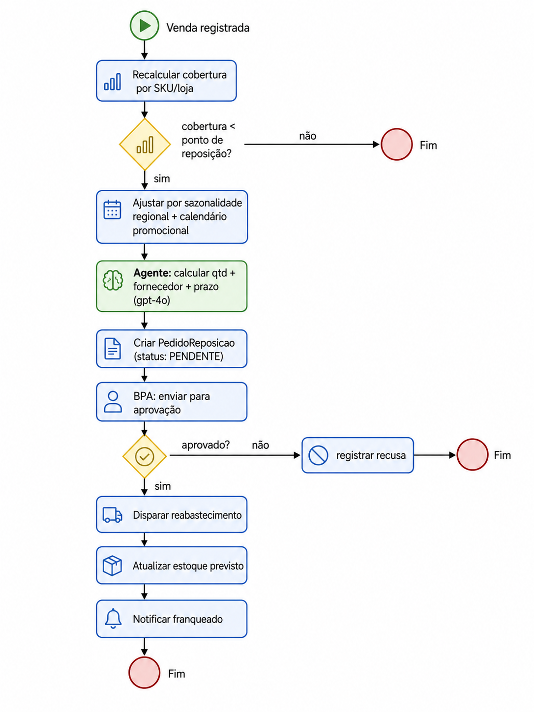

# RunMyFranchise

[🇧🇷 Português](README.md) · **🇬🇧 English**

> **SAP BTP solution for franchise network management**
> Dragons' Den: Learn to Win Edition 2026 — SAP Solution Advisory

---

## Overview

**Problem:** Franchisors struggle to manage and expand networks in a standardized way. Information is scattered, compliance is manual, KPIs arrive with delays, and franchisees operate as islands — with no visibility into their own performance and no proactive guidance.

**Solution:** An SAP BTP platform that connects franchisors and franchisees in real time: network panel, automatic compliance, AI agents for recommendations and inventory replenishment, and a franchisee portal with its own dashboard.

**Anchor persona:** Alexandre Mendes — Operations Director, network of 280 fashion/lifestyle stores, wants to double the network without multiplying the chaos.

---

## Competition Context

| Item | Detail |
|---|---|
| Event | Dragons' Den: Learn to Win Edition 2026 |
| Organization | SAP Solution Advisory |
| Format | 15-min live demo + 5-min Q&A |
| Date | August 26, 2026 |
| Critical requirement | Live demo, no screenshots |
| Highest-weight criterion | Live Demo Quality (20%) |

---

## Project Status

**Deployed to production** — SAP BTP Cloud Foundry, org `sa-build-platform-org / DEV`, region `us10`.

| Component | Status |
|---|---|
| CAP Backend + HANA Cloud + XSUAA | ✅ Production |
| AI Core + GenAI Hub (gpt-4o) | ✅ Production — confirmed `modo: "GenAI Hub"` |
| Network Panel (LR + donut + OP) | ✅ Production |
| Governance & Compliance (LR + OP) | ✅ Production |
| Onboarding (LR + OP + Draft) | ✅ Production |
| Franchisee Portal (OVP — 5 cards) | ✅ Production |
| AI Recommendations (LR + OP) | ✅ Production |
| Inventory & Replenishment (LR + OP) | ✅ Production |
| Replenishment Agent (level 1-2) | ✅ Production — PENDENTE orders generated by gpt-4o |
| LR → Object Page navigation | ✅ All apps (UI5 1.136.7 pinned) |
| Joule (conversational copilot) | ⬜ Pending |
| Level-3 agent (approval via BPA) | ⬜ Pending |

**Backend:** `https://sa-build-platform-org-dev-myfranchise-srv.cfapps.us10.hana.ondemand.com`

---

## SAP BTP Architecture


### Technical Decisions

| Decision | Choice | Reason |
|---|---|---|
| Frontend | Fiori Elements + Build Work Zone | Annotation-driven, no custom app |
| Backend | SAP CAP Node.js, OData V4 | `@sap/cds ^10` |
| Database | HANA Cloud (prod) / SQLite in-memory (dev) | `@cap-js/hana ^2.8` / `@cap-js/sqlite ^2.1.3` |
| AI | AI Core + GenAI Hub (gpt-4o) | `@sap-ai-sdk/orchestration ^2.13` |
| UI5 runtime | Fixed version `1.136.7` | Aligns build and runtime; avoids `Active` behavior in FE V4 |
| CAP profiles | `hana-cloud`/`xsuaa` as default; `[development]` enables sqlite+mocked | Prevents empty apps in CF |

---

## Modules (6 Fiori apps)

### 1. Network Panel
- **Floorplan:** List Report + Object Page
- **contextPath:** `/Saude_Dashboard` → drill-down `/Unidades`
- **Highlight:** Criticality donut (`@Aggregation.ApplySupported` + `Analytics.AggregatedProperty`): Critical / Warning / Healthy. Table with color-coded score by criticality. Filter by cluster/region. Navigation to the unit's Object Page.

### 2. Governance & Compliance
- **Floorplan:** List Report + Object Page
- **contextPath:** `/Desvios`
- **Highlight:** Automatic deviation detection in `after CREATE VendaPraticada`. Configurable rules (`RegrasCompliance`). Color-coded severity (ALTA red, MÉDIA yellow). Navigation to deviation detail.

### 3. Onboarding
- **Floorplan:** List Report + Object Page + `@odata.draft.enabled`
- **contextPath:** `/ProcessosOnboarding`
- **Highlight:** End-to-end tracking of new store openings. The list shows all in-progress processes with status and completion percentage. Clicking a process shows the manager the **steps and tasks** of that onboarding — with owner, deadline, status, and documents. Draft saves progress automatically; nothing is lost if the screen is closed. Seed included with stores in the onboarding stage (u301, u302, u303).

### 4. Inventory & Replenishment
- **Floorplan:** List Report + Object Page
- **contextPath:** `/Estoque_Unidade`
- **Highlight:** Inventory coverage calculated with **regional seasonality** (e.g., Havaianas in July: NE factor 1.8 = RUPTURA; South factor 0.4 = OK). Region filter shows the South × Northeast contrast. `coberturaDias` and `estoqueCriticality` computed in the handler considering `Sazonalidade_Regional` and `Calendario_Promocional`. Object Page with situation + location.

### 5. AI Recommendations
- **Floorplan:** List Report + Object Page
- **contextPath:** `/MinhasRecomendacoes`
- **Highlight:** Lists recommendations with color-coded priority (ALTA red). Object Page shows the **full description generated by gpt-4o** — SKUs, percentages, impact, action with deadline — without truncation.

### 6. Franchisee Portal
- **Floorplan:** Overview Page (OVP) — 5 cards (`sap.ovp.app.Component`)
- **Cards:** My Performance (6-month revenue in BRL, period "Jun/2026"), Health Score (color-coded criticality), Pending Actions (deviations with icons), AI Recommendations (gpt-4o), Network Position (cluster benchmark)
- **Highlight:** Subtitle "Porto Alegre Store" on each card. Criticality via `DataFieldForAnnotation→DataPoint`. Currency `BRL`. JWT attribute fallback middleware (IAS does not send `unidade_ID`/`cluster`).

---

## AI Agents

### Recommendations Agent (`srv/ai/recommendations-job.js`)
- **LLM:** gpt-4o via `@sap-ai-sdk/orchestration` (GenAI Hub)
- **Input:** KPIs, cluster benchmark, open compliance deviations
- **Output:** 3 prioritized recommendations (ALTA/MÉDIA/BAIXA) with rich descriptions
- **Fallback:** deterministic rules (price deviation → PRECIFICACAO; revenue drop → CAMPANHA; low NPS → TREINAMENTO)
- **Actions:** `gerarRecomendacoes(unidade_ID)`, `gerarRecomendacoesTodas()`

### Replenishment Agent (`srv/ai/reposicao-agent.js`)
- **LLM:** gpt-4o via GenAI Hub (same pattern)
- **Input:** stock balance, average turnover, lead time, regional seasonal factor, promotional uplift
- **Output:** `Pedidos_Reposicao` in **PENDENTE** status — calculated quantity (turnover × lead time × seasonal factor), suggested supplier, detailed justification
- **Seasonal logic:** `coberturaDias = saldoAtual / (giroMedioDiario × fatorSazonal × upliftPromo)`. Stockout when `coberturaDias < leadTimeDias`.
- **Actions:** `gerarReposicao(unidade_ID)`, `gerarReposicaoTodas()`
- **Level:** 1-2 (detects + proposes). Level 3 (approval via BPA) = next step.

---

## Focus Scenario — Inventory Stockout

Inventory stockout is one of the key operational risks in franchise networks: out-of-stock products cause lost sales, franchisee dissatisfaction, and brand damage. The differentiator lies in **anticipating** the stockout by factoring in regional seasonality — the same replenishment strategy does not work for all regions.

**Demo with real data (July — reference month):**

| Store | Region | SKU | Coverage (Jul) | Status |
|---|---|---|---|---|
| Recife (u178) | NE | Havaianas Top | 2.6 days | 🔴 RUPTURA |
| Salvador (u156) | NE | Havaianas Top | 1.8 days | 🔴 RUPTURA |
| Porto Alegre (u147) | S | Havaianas Top | 66.7 days | 🟢 OK |
| Porto Alegre (u147) | S | Bota Couro Inverno | 1.8 days | 🔴 RUPTURA |

Same product, same month → opposite risk by region. The agent calculates coverage with the regional seasonal factor and generates replenishment orders with gpt-4o justification, also considering the promotional calendar.

> **Demo scenario:** the inventory stockout case is the main focus of the August 26 demonstration. Other scenarios (compliance, onboarding, AI recommendations) may be included based on team analysis.

### Demo Flow



### Data validated in production — Porto Alegre Store (u147)

| Data | Value |
|---|---|
| Health Score | **32 / 100** — critical (red) |
| Compliance | 45% |
| Revenue Jun/2026 | R$ 162,378 (decline from R$ 199k in Feb → R$ 162k in Jun) |
| Detected deviations | 4 (Casual Sneaker −14.3% ALTA, Cap −24.1% ALTA, Dress −8.8% MÉDIA, unauthorized Short) |
| AI Recommendations | 3 — via gpt-4o (`modo: "GenAI Hub"` confirmed) |
| Network donut | 4 critical / 9 warning / 7 healthy (20 units) |

**Detailed script:** see `teste/ROTEIRO_DEMO.md` (4 acts: Overview → Root Cause → AI → Endpoint)

---

## Tech Stack

```
@sap/cds                   ^10.0.5     # CAP backend (OData V4)
@cap-js/sqlite             ^2.1.3      # SQLite in-memory (dev)
@cap-js/hana               ^2.8.0      # HANA Cloud (prod)
@sap-ai-sdk/orchestration  ^2.13.0     # GenAI Hub — gpt-4o
@sap/xssec                 ^4.13.3     # XSUAA authorization
express                    ^4.22.2     # HTTP runtime

SAP HANA Cloud                         # production database
SAP Build Work Zone                    # portal and launchpad (managed approuter)
SAP AI Core + GenAI Hub               # AI agents (gpt-4o)
SAP IAS + XSUAA                       # identity and authorization
SAPUI5 1.136.7                        # Fiori Elements runtime (pinned version)
```

**CAP profiles:** `hana-cloud`/`xsuaa` as **default**; `[development]` automatically enables sqlite+mocked with `cds watch`.

---

## Project Structure

```
MyFranchise/
├── db/
│   ├── schema.cds              # Data model (all modules)
│   └── data/                   # 43 seed CSV files
│       ├── myfranchise-Franqueados.csv        (8 franchisees)
│       ├── myfranchise-Unidades.csv           (20 units + 3 onboarding)
│       ├── myfranchise-KPI_Unidade.csv        (120 KPIs — 20×6 months)
│       ├── myfranchise-Saude_Unidade.csv      (20 scores)
│       ├── myfranchise-Desvios.csv            (7 deviations — Store 147)
│       ├── myfranchise-Estoque_Unidade.csv    (13 SKUs with seasonal coverage)
│       ├── myfranchise-Sazonalidade_Regional.csv (13 NE/S/SE/CO/N factors)
│       ├── myfranchise-Calendario_Promocional.csv
│       ├── myfranchise-ProcessosOnboarding.csv / Etapas / Tarefas
│       └── ... (code lists and other entities)
├── srv/
│   ├── service.cds             # FranqueadoraService + FranqueadoService
│   ├── service.js              # Handlers: deviation detection, score recalculation
│   ├── franqueado-service.js   # FranqueadoService impl: MeuEstoque enrichment
│   ├── server.js               # Middleware: franchisee JWT attribute fallback
│   └── ai/
│       ├── recommendations-job.js   # Recommendations agent (gpt-4o + fallback)
│       └── reposicao-agent.js       # Seasonal replenishment agent (gpt-4o + fallback)
├── app/
│   ├── network/          # Network Panel (LR + donut + OP)
│   ├── compliance/       # Governance & Compliance (LR + OP)
│   ├── onboarding/       # Onboarding (LR + OP×2 + Draft)
│   ├── inventory/        # Inventory & Replenishment (LR + OP)
│   ├── recommendations/  # AI Recommendations (LR + OP)
│   └── franchisee/       # Franchisee Portal (OVP — 5 cards)
├── teste/
│   └── ROTEIRO_DEMO.md         # 4-act script, checklist, plan B
├── mta.yaml                    # CF deploy (10 modules, 6 services)
├── xs-security.json            # XSUAA (roles, scopes, attributes)
├── package.json
└── README.md
```

---

## Running Locally

### Prerequisites
```bash
npm install -g @sap/cds-dk
```

### Start
```bash
npm install
cds watch
```
Open **http://localhost:4004**

### Test users

| User | Password | Role | Service |
|---|---|---|---|
| `gestor` | `gestor` | Franqueadora_Gestor | `/franqueadora` |
| `roberto` | `roberto` | Franchisee (Store 147 / cluster STD) | `/franqueado` |

### Useful endpoints
```bash
# Panel — all units with seasonal coverage
GET /franqueadora/Estoque_Unidade?$filter=sku eq 'SKU-100'

# Deviations for Store 147
GET /franqueadora/Desvios?$filter=unidade_ID eq 'u147'

# KPIs Jan–Jun (Store 147)
GET /franqueadora/KPI_Unidade?$filter=unidade_ID eq 'u147'&$orderby=periodo

# Recommendations agent (gpt-4o)
POST /franqueadora/gerarRecomendacoes   { "unidade_ID": "u147" }

# Replenishment agent (gpt-4o, with seasonality)
POST /franqueadora/gerarReposicao       { "unidade_ID": "u178" }

# Franchisee portal
GET /franqueado/MeusKPIs
GET /franqueado/MeuEstoque
GET /franqueado/MinhasRecomendacoes
```

---

## Deploy (Cloud Foundry)

```bash
mbt build
cf deploy mta_archives/myfranchise_1.0.0.mtar -f
```

The `mta.yaml` publishes 10 modules: `myfranchise-srv`, `db-deployer`, 6 HTML5 apps, `appcontent`, `destinationcontent`. Services: HANA (hdi-shared), XSUAA, HTML5 Repo (host + runtime), Destination, AI Core (existing `default_aicore`).

**After each appcontent deploy:** remove and re-add the apps in the Work Zone Content Manager to clear the cache (the site does not reload automatically).

### Work Zone — tiles

| App | `semanticObject` | `action` | Role |
|---|---|---|---|
| Network Panel | `NetworkPanel` | `display` | Franqueadora_Gestor |
| Governance & Compliance | `Compliance` | `manage` | Franqueadora_Gestor |
| Onboarding | `Onboarding` | `manage` | Franqueadora_Gestor |
| Inventory & Replenishment | `Inventory` | `manage` | Franqueadora_Gestor |
| AI Recommendations | `Recommendations` | `display` | Franqueado |
| Franchisee Portal | `FranchiseePortal` | `display` | Franqueado |

---

## Production Notes

- **Franchisee JWT attributes:** the IdP (IAS) does not send `unidade_ID`/`cluster` in the assertion. `srv/server.js` injects the default `u147`/`STD` via CAP middleware. For real production, map via IAS assertion attributes.
- **HANA/AI Core cold start:** send 1 warm-up request before the demo (HANA and AI Core have cold start of several seconds).
- **LR→OP navigation:** requires `contextPath` (not `entitySet`) + explicit `navigation` + `ResponsiveTable` in the manifest, and UI5 runtime **pinned version** (not `/resources/latest`). Version `1.136.7` has been validated.

---

## Focus Scenario — Stockout + Joule + Agent (next steps)

Confirmed scope for the August 26 demo:

### Implemented
- ✅ Model (`Estoque_Unidade`, `Sazonalidade_Regional`, `Calendario_Promocional`, `Pedidos_Reposicao`)
- ✅ Regional seasonality (demand factor by category × region × month)
- ✅ Seasonal coverage calculation in the handler
- ✅ Level 1-2 replenishment agent (detects risk + generates PENDENTE orders via gpt-4o)
- ✅ Inventory & Replenishment app with region filter (demonstrates Havaianas NE×South)

### Pending
- ⬜ **Joule** — register entities as skills for conversational queries ("will I have a Havaianas stockout in the NE in July?")
- ⬜ **Level-3 agent** — send APPROVED `Pedidos_Reposicao` for processing via SAP Build Process Automation (human-in-the-loop)
- ⬜ **Full BPMN** — flow from detection to replenishment

---

## Roadmap (post-demo)

### Intelligence and Automation
- **Joule** — conversational copilot over network data ("which stores have a stockout risk today?")
- **Level-3 Replenishment Agent** — automatic approval via SAP Build Process Automation (human-in-the-loop); orders currently remain in PENDENTE
- **SAP Build Process Automation** — approval workflows for compliance, replenishment, and onboarding
- **SAP Analytics Cloud** — executive dashboards for board and leadership (currently: Fiori Elements)

### Integration with SAP Retail Systems
- **SAP S/4HANA Retail** — integration with merchandise management and automatic replenishment orders
- **SAP Customer Activity Repository (CAR)** — real POS sales data to replace seed CSV; real-time demand feeds the replenishment agent
- **SAP Omnichannel Point-of-Sale (POS DM)** — real-time capture of store transactions; basis for price deviation and stockout detection
- **SAP Ariba** — supplier and purchase order management to close the replenishment cycle
- **SAP Integrated Business Planning (IBP)** — demand forecasting with regional seasonality to feed the agent
- **SAP Emarsys** — marketing campaigns targeted by cluster/region, integrated with the promotional calendar

### Data and Platform
- **SAP Datasphere** — data federation from multiple sources (POS, ERP, e-commerce)
- **Expansion Module** — location scoring for opening new stores
- **IAS Assertion Attributes** — map `unidade_ID`/`cluster` via IdP (remove fallback middleware)
- **HANA Sequences** — replace unit code logic with native sequences

---

## References

- [CAP Documentation](https://cap.cloud.sap/docs/)
- [SAP Fiori Elements — Feature Showcase](https://github.com/SAP-samples/fiori-elements-feature-showcase)
- [cap-sflight (reference for ALP/chart)](https://github.com/SAP-samples/cap-sflight)
- [cap-cert-petrobras (reference for LR→OP navigation)](https://github.com/marcelofiorito/cap-cert-petrobras)
- [SAP Build Work Zone](https://help.sap.com/docs/build-work-zone-standard-edition)
- [SAP AI Core + GenAI Hub](https://help.sap.com/docs/sap-ai-core)
- [OData Annotation Vocabulary](https://ui5.sap.com/#/topic/030faebe70b34198b17a93b4c6e7b4d7)
