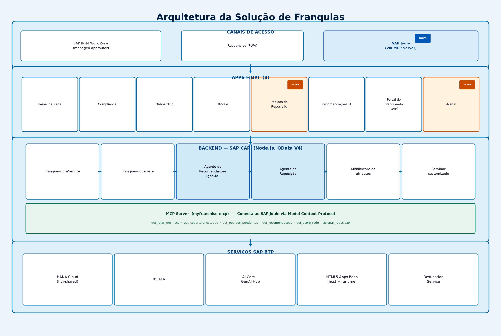

# RunMyFranchise

**🇧🇷 Português** · [🇬🇧 English](README.en.md)

> **SAP BTP solution for franchise network management**
> Dragons' Den: Learn to Win Edition 2026 — SAP Solution Advisory

---

## Visão Geral

**Problema:** Franqueadoras enfrentam dificuldade para gerenciar e expandir redes de forma padronizada. Informações ficam descentralizadas, compliance é manual, KPIs chegam com atraso e franqueados operam como ilhas — sem visibilidade da própria performance nem orientação proativa.

**Solução:** Plataforma SAP BTP que conecta franqueadora e franqueados em tempo real: painel da rede, compliance automático, agentes de IA para recomendações e reposição de estoque, e portal do franqueado com dashboard próprio.

**Persona âncora:** Alexandre Mendes — Diretor de Operações, rede de 280 lojas fashion/lifestyle, quer dobrar a rede sem multiplicar o caos.

---

## Contexto da Competição

| Item | Detalhe |
|---|---|
| Evento | Dragons' Den: Learn to Win Edition 2026 |
| Organização | SAP Solution Advisory |
| Formato | 15 min demo ao vivo + 5 min Q&A |
| Data | 26 de agosto de 2026 |
| Requisito crítico | Demo ao vivo, sem screenshots |
| Critério de maior peso | Live Demo Quality (20%) |

---

## Estado do Projeto

**Deployado em produção** — SAP BTP Cloud Foundry, org `sa-build-platform-org / DEV`, região `us10`.

| Componente | Status |
|---|---|
| Backend CAP + HANA Cloud + XSUAA | ✅ Produção |
| AI Core + GenAI Hub (gpt-4o) | ✅ Produção — confirmado `modo: "GenAI Hub"` |
| Painel da Rede (LR + donut + OP) | ✅ Produção |
| Governança & Compliance (LR + OP) | ✅ Produção |
| Onboarding (LR + OP + Draft) | ✅ Produção |
| Portal do Franqueado (OVP — 5 cards) | ✅ Produção |
| Recomendações da IA (LR + OP) | ✅ Produção |
| Estoque & Reposição (LR + OP + aba Pedidos) | ✅ Produção — aba Pedidos de Reposição no Object Page |
| Agente de Reposição (nível 1-2) | ✅ Produção — pedidos PENDENTE gerados por gpt-4o |
| Pedidos de Reposição (LR + OP + Aprovar/Recusar) | ✅ Produção — bound actions + app dedicado |
| Joule (copiloto conversacional) | ✅ Produção — MCP Server + 7 tools (leitura + aprovação via linguagem natural) |
| KPI tiles dinâmicos (ruptura + pendentes) | ✅ Produção — número ao vivo nos tiles do launchpad |
| App Admin (reset + simulação demo) | ✅ Produção — resetarDemo + simularRecebimento com 1 clique |
| Agente nível 3 (aprovação automática via BPA) | ⬜ Pós-demo — hoje aprovação é manual (Joule ou app) |

**Backend:** `https://sa-build-platform-org-dev-myfranchise-srv.cfapps.us10.hana.ondemand.com`

---

## Arquitetura SAP BTP




### Decisões Técnicas

| Decisão | Escolha | Motivo |
|---|---|---|
| Frontend | Fiori Elements + Build Work Zone | Annotation-driven, sem app nativo |
| Backend | SAP CAP Node.js, OData V4 | `@sap/cds ^10` |
| Banco de dados | HANA Cloud (prod) / SQLite in-memory (dev) | `@cap-js/hana ^2.8` / `@cap-js/sqlite ^2.1.3` |
| IA | AI Core + GenAI Hub (gpt-4o) | `@sap-ai-sdk/orchestration ^2.13` |
| UI5 runtime | Versão fixa `1.136.7` | Alinha build e runtime; evita comportamento `Active` no FE V4 |
| Perfis CAP | `hana-cloud`/`xsuaa` como default; `[development]` ativa sqlite+mocked | Evita apps vazios em CF |

---

## Módulos (8 apps Fiori + Joule)

### 1. Painel da Rede
- **Floorplan:** List Report + Object Page
- **contextPath:** `/Saude_Dashboard` → drill-down `/Unidades`
- **Destaque:** Donut de criticidade (`@Aggregation.ApplySupported`): Crítico / Atenção / Saudável. Tabela com score colorido. Filtro por cluster/região.

### 2. Governança & Compliance
- **Floorplan:** List Report + Object Page
- **contextPath:** `/Desvios`
- **Destaque:** Detecção automática de desvios no `after CREATE VendaPraticada`. Severidade colorida (ALTA vermelho, MÉDIA amarelo).

### 3. Onboarding
- **Floorplan:** List Report + Object Page + `@odata.draft.enabled`
- **contextPath:** `/ProcessosOnboarding`
- **Destaque:** Acompanhamento ponta a ponta da abertura de novas lojas. Draft salva progresso automaticamente.

### 4. Estoque & Reposição
- **Floorplan:** List Report + Object Page
- **contextPath:** `/Estoque_Unidade`
- **Destaque:** Cobertura calculada com sazonalidade regional. Object Page com aba **Pedidos de Reposição** — ao clicar num item em ruptura, o gestor vê os pedidos gerados pelo agente para aquele SKU/loja. KPI tile dinâmico: número de itens em ruptura (refresh 30s).

### 5. Pedidos de Reposição
- **Floorplan:** List Report + Object Page
- **contextPath:** `/Pedidos_Reposicao`
- **Destaque:** App dedicado para o gestor aprovar/recusar pedidos gerados pelo Agente de Reposição. Filtros por status, região e origem (Agente IA / Manual). Botões **Aprovar** e **Recusar** com diálogo de parâmetros. KPI tile dinâmico: número de pedidos pendentes (refresh 30s).

### 6. Recomendações da IA
- **Floorplan:** List Report + Object Page
- **contextPath:** `/MinhasRecomendacoes`
- **Destaque:** Recomendações geradas pelo gpt-4o com descrição completa, prioridade colorida.

### 7. Portal do Franqueado
- **Floorplan:** Overview Page (OVP) — 5 cards
- **Destaque:** Faturamento, Score, Desvios, Recomendações IA, Benchmark do cluster. Cada card restrito à loja do franqueado.

### 8. Admin (controle da demo)
- **Floorplan:** UI5 customizado (page + botões)
- **Destaque:** Painel de controle para pré-demo. Mostra KPIs ao vivo (pedidos PENDENTE + itens em RUPTURA). Botões: **Resetar Demo** (volta pedidos para PENDENTE), **Simular Recebimento** (APROVADO → RECEBIDO + saldo reposto no estoque), **Gerar Pedidos com IA**, **Gerar Recomendações**. Log de operações com timestamp.

### Joule (copiloto conversacional)
- **MCP Server:** `joule-myfranchise-mcp` (Python FastMCP, CF)
- **7 tools:** `get_lojas_em_risco`, `get_cobertura_estoque`, `get_pedidos_pendentes`, `get_recomendacoes`, `get_score_rede`, `aprovar_pedido`, `recusar_pedido`
- **Fluxo validado:** aprovação de 6 pedidos por linguagem natural end-to-end
- **Exemplo:** *"Aprova todos os pedidos de Havaianas pendentes"* → Joule lista, identifica IDs e aprova todos automaticamente

---

## Agentes de IA

### Agente de Recomendações (`srv/ai/recommendations-job.js`)
- **LLM:** gpt-4o via `@sap-ai-sdk/orchestration` (GenAI Hub)
- **Input:** KPIs, benchmark do cluster, desvios de compliance abertos
- **Output:** 3 recomendações priorizadas (ALTA/MÉDIA/BAIXA) com descrição rica
- **Fallback:** regras determinísticas (desvio de preço → PRECIFICACAO; queda de faturamento → CAMPANHA; NPS baixo → TREINAMENTO)
- **Actions:** `gerarRecomendacoes(unidade_ID)`, `gerarRecomendacoesTodas()`

### Agente de Reposição (`srv/ai/reposicao-agent.js`)
- **LLM:** gpt-4o via GenAI Hub (mesmo padrão)
- **Input:** saldo de estoque, giro médio, lead time, fator sazonal regional, uplift promocional
- **Output:** `Pedidos_Reposicao` em status **PENDENTE** — quantidade calculada (giro × lead time × fator sazonal), fornecedor sugerido, justificativa detalhada
- **Lógica sazonal:** `coberturaDias = saldoAtual / (giroMedioDiario × fatorSazonal × upliftPromo)`. Ruptura quando `coberturaDias < leadTimeDias`.
- **Actions:** `gerarReposicao(unidade_ID)`, `gerarReposicaoTodas()`
- **Nível:** 1-2 (detecta + propõe). Nível 3 (aprovação via BPA) = próximo passo.

---

## Caso de Foco — Ruptura de Estoque

Ruptura de estoque é um dos principais riscos operacionais em redes de franquias: falta de produto gera venda perdida, insatisfação do franqueado e dano à marca. O diferencial está em **antecipar** a ruptura considerando sazonalidade regional — a mesma estratégia de reposição não serve para todas as regiões.

**Demonstração com dados reais (julho — mês de referência):**

| Loja | Região | SKU | Cobertura (jul) | Status |
|---|---|---|---|---|
| Recife (u178) | NE | Havaianas Top | 2,6 dias | 🔴 RUPTURA |
| Salvador (u156) | NE | Havaianas Top | 1,8 dias | 🔴 RUPTURA |
| Porto Alegre (u147) | S | Havaianas Top | 66,7 dias | 🟢 OK |
| Porto Alegre (u147) | S | Bota Couro Inverno | 1,8 dias | 🔴 RUPTURA |

Mesmo produto, mesmo mês → risco oposto por região. O agente calcula cobertura com fator sazonal regional e gera pedidos de reposição com justificativa do gpt-4o, considerando também o calendário de promoções.

> **Cenário da demo:** o caso de ruptura de estoque é o foco principal da demonstração de 26/08. Outros cenários (compliance, onboarding, recomendações IA) poderão ser incluídos conforme análise do time.

### Fluxo da Demo


## Tech Stack

```
@sap/cds                   ^10.0.5     # CAP backend (OData V4)
@cap-js/sqlite             ^2.1.3      # SQLite em memória (dev)
@cap-js/hana               ^2.8.0      # HANA Cloud (prod)
@sap-ai-sdk/orchestration  ^2.13.0     # GenAI Hub — gpt-4o
@sap/xssec                 ^4.13.3     # autorização XSUAA
express                    ^4.22.2     # runtime HTTP

SAP HANA Cloud                         # banco de dados em produção
SAP Build Work Zone                    # portal e launchpad (managed approuter)
SAP AI Core + GenAI Hub               # agentes de IA (gpt-4o)
SAP IAS + XSUAA                       # identidade e autorização
SAPUI5 1.136.7                        # runtime Fiori Elements (versão fixada)
```

**Perfis CAP:** `hana-cloud`/`xsuaa` como **default**; `[development]` ativa sqlite+mocked automaticamente com `cds watch`.

---

## Estrutura do Projeto

```
MyFranchise/
├── db/
│   ├── schema.cds              # Modelo de dados (todos os módulos)
│   └── data/                   # CSVs de seed
│       ├── myfranchise-Estoque_Unidade.csv    (13 SKUs com cobertura sazonal)
│       ├── myfranchise-Pedidos_Reposicao.csv  (6 pedidos PENDENTE — gpt-4o)
│       ├── myfranchise-OrigemPedido.csv        (AGENTE / MANUAL)
│       └── ... (demais entidades e code lists)
├── srv/
│   ├── service.cds             # FranqueadoraService + FranqueadoService
│   ├── service.js              # Handlers: desvios, score, estoque, aprovação pedidos, KPI endpoints
│   ├── franqueado-service.js   # Impl FranqueadoService
│   ├── server.js               # Middleware JWT + endpoints /kpi/ruptura e /kpi/pedidos-pendentes
│   └── ai/
│       ├── recommendations-job.js   # Agente de recomendações (gpt-4o + fallback)
│       └── reposicao-agent.js       # Agente de reposição sazonal (gpt-4o + fallback)
├── app/
│   ├── network/          # Painel da Rede (LR + donut + OP)
│   ├── compliance/       # Governança & Compliance (LR + OP)
│   ├── onboarding/       # Onboarding (LR + OP×2 + Draft)
│   ├── inventory/        # Estoque & Reposição (LR + OP + aba Pedidos) — KPI tile
│   ├── replenishment/    # Pedidos de Reposição (LR + OP + Aprovar/Recusar) — KPI tile
│   ├── recommendations/  # Recomendações da IA (LR + OP)
│   └── franchisee/       # Portal do Franqueado (OVP — 5 cards)
├── docs/
│   ├── especificação/SPEC.md               # Especificação técnica
│   ├── requisitos/PRD.md                   # Product Requirements Document
│   ├── integração/                         # Setup Joule, MCP Server, integração SAP
│   ├── ideias/visao-produto.md             # Roadmap pós-demo
│   └── arquitetura_solucao_franquias_v2.png  # Diagrama de arquitetura (v2)
├── teste/
│   └── ROTEIRO_DEMO.md   # Roteiro 4 atos, checklist, plano B
├── mta.yaml              # Deploy CF (11 módulos, 6 serviços)
├── xs-security.json      # XSUAA (roles, scopes, atributos)
└── README.md
```

---

## Executar Localmente

### Pré-requisitos
```bash
npm install -g @sap/cds-dk
```

### Iniciar
```bash
npm install
cds watch
```
Acesse **http://localhost:4004**

### Usuários de teste

| Usuário | Senha | Role | Serviço |
|---|---|---|---|
| `gestor` | `gestor` | Franqueadora_Gestor | `/franqueadora` |
| `roberto` | `roberto` | Franqueado (Loja Porto Alegre / u147 / cluster STD) | `/franqueado` |

### Endpoints úteis
```bash
# Painel — todas as unidades com cobertura sazonal
GET /franqueadora/Estoque_Unidade?$filter=sku eq 'SKU-100'

# Desvios da Loja Porto Alegre (147)
GET /franqueadora/Desvios?$filter=unidade_ID eq 'u147'

# KPIs jan–jun (Loja Porto Alegre / 147)
GET /franqueadora/KPI_Unidade?$filter=unidade_ID eq 'u147'&$orderby=periodo

# Agente de recomendações (gpt-4o)
POST /franqueadora/gerarRecomendacoes   { "unidade_ID": "u147" }

# Agente de reposição (gpt-4o, com sazonalidade)
POST /franqueadora/gerarReposicao       { "unidade_ID": "u178" }

# Portal do franqueado
GET /franqueado/MeusKPIs
GET /franqueado/MeuEstoque
GET /franqueado/MinhasRecomendacoes
```

---

## Deploy (Cloud Foundry)

```bash
mbt build
cf deploy mta_archives/myfranchise_1.0.0.mtar -f
```

O `mta.yaml` publica 10 módulos: `myfranchise-srv`, `db-deployer`, 6 apps HTML5, `appcontent`, `destinationcontent`. Serviços: HANA (hdi-shared), XSUAA, HTML5 Repo (host + runtime), Destination, AI Core (existing `default_aicore`).

**Após cada deploy do appcontent:** remover e re-adicionar os apps no Content Manager do Work Zone para limpar o cache (o site não recarrega automaticamente).

### Work Zone — tiles

| App | `semanticObject` | `action` | Role | KPI tile |
|---|---|---|---|---|
| Painel da Rede | `NetworkPanel` | `display` | Franqueadora_Gestor | — |
| Governança & Compliance | `Compliance` | `manage` | Franqueadora_Gestor | — |
| Onboarding | `Onboarding` | `manage` | Franqueadora_Gestor | — |
| Estoque & Reposição | `Inventory` | `manage` | Franqueadora_Gestor | `RUPTURA` count |
| Pedidos de Reposição | `Replenishment` | `manage` | Franqueadora_Gestor | `PENDENTE` count |
| Recomendações da IA | `Recommendations` | `display` | Franqueado | — |
| Portal do Franqueado | `FranchiseePortal` | `display` | Franqueado | — |

---

## Notas de Produção

- **Atributos JWT do Franqueado:** o IdP (IAS) não envia `unidade_ID`/`cluster` na asserção. `srv/server.js` injeta o default `u147`/`STD` via middleware CAP. Para produção real, mapear via IAS assertion attributes.
- **Cold start HANA/AI Core:** fazer 1 request de aquecimento antes da demo (HANA e AI Core têm cold start de segundos).
- **Navegação LR→OP:** requer `contextPath` (não `entitySet`) + `navigation` explícito + `ResponsiveTable` no manifest, e UI5 runtime **versão fixa** (não `/resources/latest`). A versão `1.136.7` foi validada.

---

## Roadmap (pós-demo)

### Inteligência e Automação
- **Agente de Reposição nível 3** — aprovação automática via SAP Build Process Automation; hoje o gestor aprova manualmente no app Pedidos de Reposição
- **SAP Build Process Automation** — workflows de aprovação para compliance, reposição e onboarding
- **SAP Analytics Cloud** — dashboards executivos (hoje: Fiori Elements)

### Integração com Sistemas Retail SAP
- **SAP S/4HANA Retail** — pedidos de reposição automáticos
- **SAP Customer Activity Repository (CAR)** — dados reais de vendas no PDV
- **SAP Ariba** — gestão de fornecedores para fechar o ciclo de reposição
- **SAP Integrated Business Planning (IBP)** — previsão de demanda com sazonalidade regional

### Dados e Plataforma
- **SAP Datasphere** — federação de dados de múltiplas fontes
- **IAS Assertion Attributes** — mapear `unidade_ID`/`cluster` via IdP (remover middleware de fallback)
- **HANA Sequences** — substituir lógica de código de unidade por sequence nativa

---

## 📚 Documentação

Todos os documentos do projeto, organizados por categoria. Cada documento contém um link de retorno ao README.

| Categoria | Documento | Descrição |
|---|---|---|
| Produto | [Product Requirements Document](docs/requisitos/PRD.md) | Requisitos funcionais, personas, critérios de aceite |
| Produto | [Visão de Produto Pós-Demo](docs/ideias/visao-produto.md) | Roadmap conceitual para uso como ativo de pré-vendas |
| Técnica | [Especificação Técnica](docs/especificação/SPEC.md) | Modelo de dados, serviços OData, handlers, segurança |
| Técnica | [Integração SAP Retail Portfolio](docs/integração/Integração.md) | Análise de fit com S/4HANA, IBP, CAR, Ariba |
| Técnica | [Setup Joule no Work Zone](docs/integração/joule.md) | Pré-requisitos e configuração do MCP no Work Zone |
| Técnica | [MCP Server — Joule](docs/integração/mcp-server.md) | 6 ferramentas, arquitetura do servidor, troubleshooting |
| Demo | [Roteiro de Demo](teste/ROTEIRO_DEMO.md) | 5 atos, narrativa de ruptura, checklist pré-demo, plano B |
| Arquitetura | [Diagrama de Arquitetura (v2)](docs/arquitetura_solucao_franquias_v2.png) | 8 apps + MCP Server + Joule como canal de acesso |
| Arquitetura | [Slide SAP-branded (PPTX)](docs/arquitetura_solucao_franquias_v2.pptx) | Slide PowerPoint SAP 2026 com arquitetura atualizada |

---

## Referências

- [CAP Documentation](https://cap.cloud.sap/docs/)
- [SAP Fiori Elements — Feature Showcase](https://github.com/SAP-samples/fiori-elements-feature-showcase)
- [cap-sflight (referência para ALP/chart)](https://github.com/SAP-samples/cap-sflight)
- [cap-cert-petrobras (referência para navegação LR→OP)](https://github.com/marcelofiorito/cap-cert-petrobras)
- [SAP Build Work Zone](https://help.sap.com/docs/build-work-zone-standard-edition)
- [SAP AI Core + GenAI Hub](https://help.sap.com/docs/sap-ai-core)
- [OData Annotation Vocabulary](https://ui5.sap.com/#/topic/030faebe70b34198b17a93b4c6e7b4d7)
