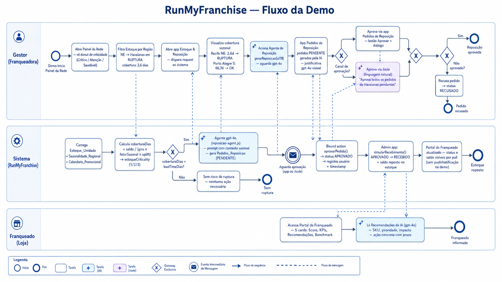
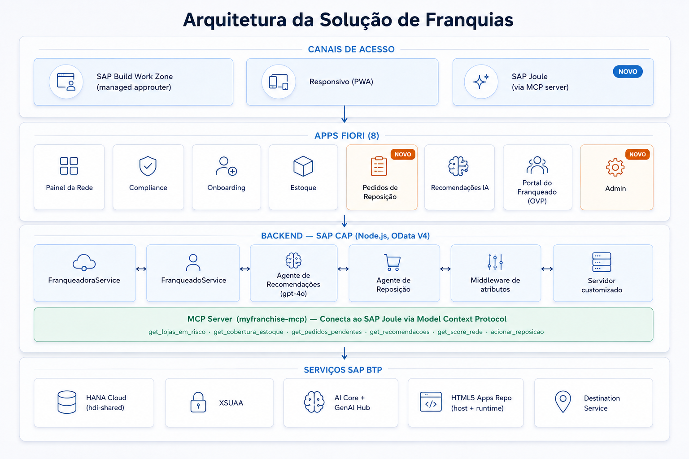

# RunMyFranchise

**🇧🇷 Português** · [🇬🇧 English](README.en.md)

> **Solução SAP BTP para gestão de redes de franquias**
> Dragons' Den: Learn to Win Edition 2026 — SAP Solution Advisory

---

## Visão Geral

**Problema:** Franqueadoras enfrentam dificuldade para gerenciar e expandir redes de forma padronizada. Informações ficam descentralizadas, compliance é manual, KPIs chegam com atraso e franqueados operam como ilhas — sem visibilidade da própria performance nem orientação proativa.

**Solução:** Plataforma SAP BTP que conecta franqueadora e franqueados em tempo real: painel da rede, compliance automático, agentes de IA para recomendações e reposição de estoque, broker de eventos autônomo (AEM) e portal do franqueado com dashboard próprio.

**Persona âncora:** Alexandre Mendes — Diretor de Operações, rede de 280 lojas fashion/lifestyle, quer dobrar a rede sem multiplicar o caos.

---

## Caso de Foco — Ruptura de Estoque

Ruptura de estoque é um dos principais riscos operacionais em redes de franquias: falta de produto gera venda perdida, insatisfação do franqueado e dano à marca. O diferencial está em **antecipar** a ruptura considerando sazonalidade regional — a mesma estratégia de reposição não serve para todas as regiões.

**Demonstração com dados reais (julho — mês de referência):**

| Loja | Região | SKU | Cobertura (jul) | Status |
|---|---|---|---|---|
| Recife (u178) | NE | Havaianas Top | 2,6 dias | 🔴 RUPTURA |
| Salvador (u156) | NE | Havaianas Top | 1,8 dias | 🔴 RUPTURA |
| Porto Alegre (u147) | S | Havaianas Top | 66,7 dias | 🟢 OK |
| Porto Alegre (u147) | S | Bota Couro Inverno | 1,8 dias | 🔴 RUPTURA |

Mesmo produto, mesmo mês → risco oposto por região. O agente calcula cobertura com fator sazonal regional e gera pedidos de reposição com justificativa do gpt-4o, considerando também o calendário de promoções.

> **Cenário da demo:** o caso de ruptura de estoque é o foco principal da demonstração de 26/08. Outros cenários (compliance, onboarding, recomendações IA) poderão ser incluídos conforme análise do time.

### Fluxo da Demo



### Dados validados em produção — Loja Porto Alegre (u147)

| Dado | Valor |
|---|---|
| Health Score | **32 / 100** — crítico (vermelho) |
| Compliance | 45% |
| Faturamento jun/2026 | R$ 162.378 (queda de R$ 199k em fev → R$ 162k em jun) |
| Desvios detectados | 4 (Tênis Casual −14,3% ALTA, Boné −24,1% ALTA, Vestido −8,8% MÉDIA, Short não autorizado) |
| Recomendações IA | 3 — via gpt-4o (`modo: "GenAI Hub"` confirmado) |
| Donut da rede | 4 críticos / 9 em atenção / 7 saudáveis (20 unidades) |

**Roteiro detalhado:** ver `teste/ROTEIRO_DEMO.md` (4 atos: Visão Geral → Causa Raiz → IA → Endpoint)

---

## Contexto da Competição

| Item | Detalhe |
|---|---|
| Evento | Dragons' Den: Learn to Win Edition 2026 |
| Organização | SAP Solution Advisory |
| Formato | 15 min demo ao vivo + 5 min Q&A |
| Data | 26 de agosto de 2026 |
| Requisito crítico | Demo ao vivo, sem screenshots |
| Critério de maior peso | Live Demo Quality (20%) |

---

## Estado do Projeto

**Deployado em produção** — SAP BTP Cloud Foundry, org `sa-build-platform-org / DEV`, região `us10`.

| Componente | Status |
|---|---|
| Backend CAP + HANA Cloud + XSUAA | ✅ Produção |
| AI Core + GenAI Hub (gpt-4o) | ✅ Produção |
| Painel da Rede (LR + donut + OP) | ✅ Produção |
| Governança & Compliance (LR + OP) | ✅ Produção |
| Onboarding (LR + OP + Draft) | ✅ Produção |
| Portal do Franqueado (OVP — 5 cards) | ✅ Produção |
| Recomendações da IA (LR + OP) | ✅ Produção |
| Estoque & Reposição (LR + OP + aba Pedidos) | ✅ Produção |
| Pedidos de Reposição (LR + OP + Aprovar/Recusar) | ✅ Produção |
| Joule (MCP Server — 9 tools) | ✅ Produção — aprovar/recusar/acionar via linguagem natural |
| KPI tiles dinâmicos (ruptura + pendentes) | ✅ Produção |
| App Admin (fluxo demo 4 etapas) | ✅ Produção — Reset → Simular Vendas → Aprovar → Receber |
| **SAP Advanced Event Mesh (AEM)** | ✅ Produção — broker pub/sub, loop de eventos autônomo |
| **Loop de Reposição Autônomo** | ✅ Produção — varredura no startup + agente orientado a eventos |
| **SAP RPT Predictive App** | ✅ Produção — `myfranchise-rpt.cfapps.us10.hana.ondemand.com` |
| Agente nível 3 (aprovação automática via BPA) | ⬜ Pós-demo — futuro: SAP BPA + IS iFlow como consumer AEM |

**Backend:** `https://sa-build-platform-org-dev-myfranchise-srv.cfapps.us10.hana.ondemand.com`

---

## Arquitetura SAP BTP



---

## Módulos (8 apps Fiori + Joule)

### 1. Painel da Rede
- **Floorplan:** List Report + Object Page
- **contextPath:** `/Saude_Dashboard` → drill-down `/Unidades`
- **Destaque:** Donut de criticidade (`@Aggregation.ApplySupported`): Crítico / Atenção / Saudável. Tabela com score colorido. Filtro por cluster/região.

### 2. Governança & Compliance
- **Floorplan:** List Report + Object Page
- **contextPath:** `/Desvios`
- **Destaque:** Detecção automática de desvios no `after CREATE VendaPraticada`. Severidade colorida (ALTA vermelho, MÉDIA amarelo).

### 3. Onboarding
- **Floorplan:** List Report + Object Page + `@odata.draft.enabled`
- **contextPath:** `/ProcessosOnboarding`
- **Destaque:** Acompanhamento ponta a ponta da abertura de novas lojas. Draft salva progresso automaticamente.

### 4. Estoque & Reposição
- **Floorplan:** List Report + Object Page
- **contextPath:** `/Estoque_Unidade`
- **Destaque:** Cobertura calculada com sazonalidade regional. Object Page com aba **Pedidos de Reposição** — ao clicar num item em ruptura, o gestor vê os pedidos gerados pelo agente para aquele SKU/loja. KPI tile dinâmico: número de itens em ruptura (refresh 30s).

### 5. Pedidos de Reposição
- **Floorplan:** List Report + Object Page
- **contextPath:** `/Pedidos_Reposicao`
- **Destaque:** App dedicado para o gestor aprovar/recusar pedidos gerados pelo Agente de Reposição. Filtros por status, região e origem (Agente IA / Manual). Botões **Aprovar** e **Recusar** com diálogo de parâmetros. KPI tile dinâmico: número de pedidos pendentes (refresh 30s).

### 6. Recomendações da IA
- **Floorplan:** List Report + Object Page
- **contextPath:** `/MinhasRecomendacoes`
- **Destaque:** Recomendações geradas pelo gpt-4o com descrição completa, prioridade colorida.

### 7. Portal do Franqueado
- **Floorplan:** Overview Page (OVP) — 5 cards
- **Destaque:** Faturamento, Score, Desvios, Recomendações IA, Benchmark do cluster. Cada card restrito à loja do franqueado.

### 8. Admin (controle da demo)
- **Floorplan:** UI5 customizado (page + botões)
- **Serviço:** `FranqueadoraService` — role `Franqueadora_Gestor`
- **Destaque:** Painel de controle para a demo. Mostra KPIs ao vivo (pedidos PENDENTE + itens em RUPTURA). Fluxo de 4 etapas:
  - **Etapa 1 — Resetar Demo**: todos os 13 estoques → OK (saldo ~180), todos os pedidos excluídos, health scores recalculados
  - **Etapa 2 — Simular Rush de Vendas**: reduz 8 SKUs para RUPTURA/ATENCAO → emite eventos AEM → agente cria pedidos PENDENTE automaticamente (~15s)
  - **Etapa 3 — Aprovar (via Joule ou app)**: aprovar todos os pedidos pendentes
  - **Etapa 4 — Simular Recebimento**: repõe estoque → emite eventos AEM → handler registra a resolução
  - Log de operações com timestamp (últimas 20 ações)

### Joule (copiloto conversacional)
- **MCP Server Python:** `joule-myfranchise-mcp` (Python FastMCP, CF — ativo no Joule Studio)
  `https://joule-myfranchise-mcp.cfapps.us10.hana.ondemand.com`
- **MCP Server Node.js:** `myfranchise-mcp` (Node.js, CF — mesmas 9 tools, HANA direto, mais rápido)
  `https://sa-build-platform-org-dev-myfranchise-mcp.cfapps.us10.hana.ondemand.com`
- **9 tools:**

| Tool | Descrição |
|---|---|
| `get_lojas_em_risco` | Lojas em risco de ruptura, filtradas por região/categoria |
| `get_cobertura_estoque` | Cobertura em dias para uma loja/SKU específico |
| `get_pedidos_pendentes` | Pedidos de reposição aguardando aprovação |
| `get_recomendacoes` | Recomendações da IA por loja e prioridade |
| `get_score_rede` | Scores de saúde na rede |
| `aprovar_pedido` | Aprovar pedido individual por ID |
| `recusar_pedido` | Recusar pedido individual por ID |
| `aprovar_pedidos` | Aprovar TODOS os pedidos pendentes (rede ou por loja) |
| `acionar_reposicao` | Acionar Agente de Reposição para uma ou todas as lojas |

- **Fluxo validado:** aprovação de pedidos por linguagem natural end-to-end
- **Exemplo:** *"Aprova todos os pedidos de Havaianas pendentes"* → Joule lista, identifica IDs e aprova todos automaticamente
- **Nomes de lojas:** todos os tools aceitam nome por extenso (ex: "Porto Alegre") — resolvem o ID automaticamente
- **Auth:** OAuth2 `client_credentials` via XSUAA; busca CSRF token antes de ações POST

---

## SAP Advanced Event Mesh (AEM)

A integração com o **SAP Advanced Event Mesh** (Solace PubSub+) está totalmente funcional em produção.

- **Plugin:** `@cap-js/advanced-event-mesh` com wrapper customizado `PatchedAEM` (`srv/aem-patched.js`)
- **Correção:** Basic Auth no `createSession` (OAuth não funciona no plano Developer 100)
- **Consumer:** fila separada `myfranchise-consumer` com owner `solace-cloud-client`
- **3 tópicos ativos:**
  - `Estoque/Changed` — emitido ao criar/atualizar itens de estoque
  - `Pedido/StatusChanged` — emitido ao aprovar/recusar pedidos
  - `Desvio/Detectado` — emitido ao detectar desvio de compliance
- **Broker:** `mr-connection-yfqw57w6xwk.messaging.solace.cloud`
- **Dev:** `file-based-messaging`; **Produção:** `advanced-event-mesh`

### Loop de Eventos Autônomo (`srv/events/messaging.js`)

- **No startup:** varre todos os itens em ruptura → emite eventos → agente cria pedidos automaticamente
- **`messaging.on(TOPIC_ESTOQUE)`:** RUPTURA/ATENCAO → aciona Agente de Reposição sem intervenção humana
- **`messaging.on(TOPIC_PEDIDO)`:** registra eventos de aprovação
- **Consumer futuro:** SAP BPA + Integration Suite via iFlow

---

## Agentes de IA

### Agente de Recomendações (`srv/ai/recommendations-job.js`)
- **LLM:** gpt-4o via `@sap-ai-sdk/orchestration` (GenAI Hub)
- **Input:** KPIs, benchmark do cluster, desvios de compliance abertos
- **Output:** 3 recomendações priorizadas (ALTA/MÉDIA/BAIXA) com descrição rica
- **Fallback:** regras determinísticas (desvio de preço → PRECIFICACAO; queda de faturamento → CAMPANHA; NPS baixo → TREINAMENTO)
- **Actions:** `gerarRecomendacoes(unidade_ID)`, `gerarRecomendacoesTodas()`

### Agente de Reposição (`srv/ai/reposicao-agent.js`)
- **LLM:** gpt-4o via GenAI Hub (mesmo padrão)
- **Input:** saldo de estoque, giro médio, lead time, fator sazonal regional, uplift promocional
- **Output:** `Pedidos_Reposicao` em status **PENDENTE** — quantidade calculada (giro × lead time × fator sazonal), fornecedor sugerido, justificativa detalhada
- **Lógica sazonal:** `coberturaDias = saldoAtual / (giroMedioDiario × fatorSazonal × upliftPromo)`. Ruptura quando `coberturaDias < leadTimeDias`.
- **Actions:** `gerarReposicao(unidade_ID)`, `gerarReposicaoTodas()`
- **Nível:** 1-2 (detecta + propõe). Nível 3 (aprovação via BPA) = próximo passo.

---

## Fórmula do Health Score

```
scoreSaude = (performancePct × 0,35) + (compliancePct × 0,35) + (scoreContrato × 0,15) + (estoquePct × 0,15)

performancePct = min(kpi.faturamento / benchmark.faturamentoMedio × 100, 100)
                 default 50 se não há KPI ou benchmark disponível

compliancePct  = max(0, 100 − desviosAbertos × 12)
                 cada desvio ABERTO ou NOTIFICADO custa 12 pontos

scoreContrato:   ATIVO            → 100
                 VENCENDOEM90DIAS →  60
                 VENCENDOEM30DIAS →  30
                 outro / expirado →   0

estoquePct     = max(0, 100 − rupturas × 25 − atencoes × 10)
                 reflete rupturas imediatamente ao chamar simularVendas

Limiares de criticidade:
  scoreSaude < 45  → 1 CRÍTICO  (vermelho)
  45 ≤ score < 70  → 2 ATENÇÃO  (amarelo)
  score ≥ 70       → 3 SAUDÁVEL (verde)
```

---

## Modelo de Segurança

O isolamento de dados entre franqueados é implementado via **autorização baseada em instância** com XSUAA e SAP Cloud Identity Services (IAS):

- Cada usuário franqueado recebe um atributo customizado `unidade_ID` no IAS/XSUAA durante o onboarding.
- O CAP aplica automaticamente filtros em tempo de query via anotações `@restrict`: `where: 'unidade_ID = $user.unidade_ID'`.
- Nenhuma query entre franqueados é possível sem o role `Franqueadora_Gestor`.
- Modelo padrão: **single-tenant com segurança em nível de linha** — adequado para centenas de unidades. Para escala SaaS multi-tenant, o CAP suporta evolução para `@multitenancy` com tenants isolados por assinante.

---

## Documentação

Todos os documentos do projeto, organizados por categoria. Cada documento contém um link de retorno ao README.

| Categoria | Documento | Descrição |
|---|---|---|
| Negócio | [Product Requirements Document](docs/requisitos/PRD.md) | Requisitos funcionais, personas, histórias de usuário e critérios de aceite |
| Negócio | [Roteiro de Demo](teste/ROTEIRO_DEMO.md) | 4 atos, narrativa de ruptura, checklist pré-demo e plano B |
| Técnica | [Especificação Técnica](docs/especificação/SPEC.md) | Modelo de dados, serviços OData, handlers CAP e anotações de segurança |
| Técnica | [Integração SAP Retail Portfolio](docs/integração/Integração.md) | Análise de fit com S/4HANA, IBP, CAR e Ariba |
| Técnica | [Setup Joule no Work Zone](docs/integração/joule.md) | Pré-requisitos e configuração do MCP Server no Work Zone |
| Técnica | [MCP Server — Joule](docs/integração/mcp-server.md) | 9 ferramentas, arquitetura do servidor, deploy e troubleshooting |
| Ideias | [Visão de Produto Pós-Demo](docs/ideias/visao-produto.md) | Roadmap conceitual para uso como ativo de pré-vendas após a demo |
| Arquitetura | [Diagrama de Arquitetura (Draw.io)](docs/imagens/arquitetura-runmyfranchise.drawio) | Fonte editável do diagrama de arquitetura (Draw.io com estilo SAP) |
| Arquitetura | [SAP Shape Libraries](docs/sap-shape-libraries/) | Bibliotecas de shapes SAP utilizadas no diagrama Draw.io |

---

## Decisões Técnicas

| Decisão | Escolha | Motivo |
|---|---|---|
| Frontend | Fiori Elements + Build Work Zone | Annotation-driven, sem app nativo |
| Backend | SAP CAP Node.js, OData V4 | `@sap/cds ^10` |
| Banco de dados | HANA Cloud (prod) / SQLite in-memory (dev) | `@cap-js/hana ^2.8` / `@cap-js/sqlite ^2.1.3` |
| IA | AI Core + GenAI Hub (gpt-4o) | `@sap-ai-sdk/orchestration ^2.13` |
| Mensageria | SAP Advanced Event Mesh (Solace) | `@cap-js/advanced-event-mesh ^1.0.0` |
| Predição | SAP RPT 1.5-large via AI Core | Zero-shot, sem treinamento, in-context learning |
| UI5 runtime | Versão fixa `1.136.7` | Alinha build e runtime; evita comportamento `Active` no FE V4 |
| Perfis CAP | `hana-cloud`/`xsuaa` como default; `[development]` ativa sqlite+mocked | Evita apps vazios em CF |

---

## Tech Stack

```
@sap/cds                   ^10.0.5     # Backend CAP (OData V4)
@cap-js/sqlite             ^2.1.3      # SQLite em memória (dev)
@cap-js/hana               ^2.8.0      # HANA Cloud (prod)
@sap-ai-sdk/orchestration  ^2.13.0     # GenAI Hub — gpt-4o
@sap/xssec                 ^4.13.3     # Autorização XSUAA
express                    ^4.22.2     # Runtime HTTP
@cap-js/advanced-event-mesh ^1.0.0    # SAP Advanced Event Mesh (Solace PubSub+)
streamlit                  1.37.0      # App preditivo RPT
sap-rpt-1.5-large                      # SAP Relational Pretrained Transformer (AI Core)

SAP HANA Cloud                         # Banco de dados em produção
SAP Build Work Zone                    # Portal e launchpad (managed approuter)
SAP AI Core + GenAI Hub               # Agentes de IA (gpt-4o) + RPT preditivo
SAP Advanced Event Mesh               # Broker de eventos pub/sub (Solace PubSub+)
SAP IAS + XSUAA                       # Identidade e autorização
SAPUI5 1.136.7                        # Runtime Fiori Elements (versão fixada)
```

**Perfis CAP:** `hana-cloud`/`xsuaa` como **default**; `[development]` ativa sqlite+mocked automaticamente com `cds watch`.

---

## Estrutura do Projeto

```
MyFranchise/
├── db/
│   ├── schema.cds              # Modelo de dados (todos os módulos)
│   └── data/                   # CSVs de seed
│       ├── myfranchise-Estoque_Unidade.csv    (13 SKUs com cobertura sazonal)
│       ├── myfranchise-Pedidos_Reposicao.csv  (6 pedidos PENDENTE — gpt-4o)
│       ├── myfranchise-OrigemPedido.csv        (AGENTE / MANUAL)
│       └── ... (demais entidades e code lists)
├── srv/
│   ├── service.cds             # FranqueadoraService + FranqueadoService
│   ├── service.js              # Handlers: desvios, score, estoque, aprovação pedidos, KPI endpoints
│   ├── franqueado-service.js   # Impl FranqueadoService
│   ├── server.js               # Middleware JWT + endpoints /kpi/ruptura e /kpi/pedidos-pendentes
│   ├── mcp-server.js           # Bridge MCP Server Node.js (CF)
│   ├── aem-patched.js          # PatchedAEM — correção Basic Auth para plano Developer 100
│   ├── events/
│   │   └── messaging.js        # Handlers de eventos autônomos (tópicos AEM)
│   └── ai/
│       ├── recommendations-job.js   # Agente de recomendações (gpt-4o + fallback)
│       └── reposicao-agent.js       # Agente de reposição sazonal (gpt-4o + fallback)
├── app/
│   ├── network/          # Painel da Rede (LR + donut + OP)
│   ├── compliance/       # Governança & Compliance (LR + OP)
│   ├── onboarding/       # Onboarding (LR + OP + Draft)
│   ├── inventory/        # Estoque & Reposição (LR + OP + aba Pedidos) — KPI tile
│   ├── replenishment/    # Pedidos de Reposição (LR + OP + Aprovar/Recusar) — KPI tile
│   ├── recommendations/  # Recomendações da IA (LR + OP)
│   ├── franchisee/       # Portal do Franqueado (OVP — 5 cards)
│   └── admin/            # Admin — Controle da Demo (UI5 customizado)
├── joule-mcp/
│   └── mcp_server_cf.py        # Python FastMCP — 9 tools, ativo no Joule Studio
├── rpt-predicao/               # App preditivo SAP RPT (Streamlit)
│   ├── app.py                  # App principal — predição RPT em 2 etapas
│   ├── dados/historico_estoque_franquias.csv  # Dados de treinamento (94 linhas)
│   └── requirements.txt
├── docs/
│   ├── especificação/SPEC.md               # Especificação técnica
│   ├── requisitos/PRD.md                   # Product Requirements Document
│   ├── integração/                         # Setup Joule, MCP Server, integração SAP
│   ├── ideias/visao-produto.md             # Roadmap pós-demo
│   └── imagens/
│       ├── arquitetura_solucao_franquias_v2_en.png  # Diagrama de arquitetura (EN)
│       ├── arquitetura_solucao_franquias_v2.png     # Diagrama de arquitetura (PT)
│       ├── bpmn_en.png                              # Fluxo da demo BPMN (EN)
│       └── bpmn_pt.png                              # Fluxo da demo BPMN (PT)
├── teste/
│   └── ROTEIRO_DEMO.md   # Roteiro 4 atos, checklist, plano B
├── manifest-rpt.yml      # Deploy CF para app RPT
├── mta.yaml              # Deploy CF (11 módulos, 6 serviços)
├── xs-security.json      # XSUAA (roles, scopes, atributos)
└── README.md
```

---

## Executar Localmente

### Pré-requisitos
```bash
npm install -g @sap/cds-dk
```

### Iniciar
```bash
npm install
cds watch
```
Acesse **http://localhost:4004**

### Usuários de teste

| Usuário | Senha | Role | Serviço |
|---|---|---|---|
| `gestor` | `gestor` | Franqueadora_Gestor | `/franqueadora` |
| `roberto` | `roberto` | Franqueado (Loja Porto Alegre / u147 / cluster STD) | `/franqueado` |

### Endpoints úteis
```bash
# Painel — todas as unidades com cobertura sazonal
GET /franqueadora/Estoque_Unidade?$filter=sku eq 'SKU-100'

# Desvios da Loja Porto Alegre (147)
GET /franqueadora/Desvios?$filter=unidade_ID eq 'u147'

# KPIs jan–jun (Loja Porto Alegre / 147)
GET /franqueadora/KPI_Unidade?$filter=unidade_ID eq 'u147'&$orderby=periodo

# Agente de recomendações (gpt-4o)
POST /franqueadora/gerarRecomendacoes   { "unidade_ID": "u147" }

# Agente de reposição (gpt-4o, com sazonalidade)
POST /franqueadora/gerarReposicao       { "unidade_ID": "u178" }

# Portal do franqueado
GET /franqueado/MeusKPIs
GET /franqueado/MeuEstoque
GET /franqueado/MinhasRecomendacoes
```

---

## Deploy (Cloud Foundry)

```bash
mbt build
cf deploy mta_archives/myfranchise_1.0.0.mtar -f
```

O `mta.yaml` publica 10 módulos: `myfranchise-srv`, `db-deployer`, 6 apps HTML5, `appcontent`, `destinationcontent`. Serviços: HANA (hdi-shared), XSUAA, HTML5 Repo (host + runtime), Destination, AI Core (existing `default_aicore`), Advanced Event Mesh.

**Após cada deploy do appcontent:** remover e re-adicionar os apps no Content Manager do Work Zone para limpar o cache (o site não recarrega automaticamente).

### Work Zone — tiles

| App | `semanticObject` | `action` | Role | KPI tile |
|---|---|---|---|---|
| Painel da Rede | `NetworkPanel` | `display` | Franqueadora_Gestor | — |
| Governança & Compliance | `Compliance` | `manage` | Franqueadora_Gestor | — |
| Onboarding | `Onboarding` | `manage` | Franqueadora_Gestor | — |
| Estoque & Reposição | `Inventory` | `manage` | Franqueadora_Gestor | contagem `RUPTURA` |
| Pedidos de Reposição | `Replenishment` | `manage` | Franqueadora_Gestor | contagem `PENDENTE` |
| Recomendações da IA | `Recommendations` | `display` | Franqueado | — |
| Portal do Franqueado | `FranchiseePortal` | `display` | Franqueado | — |

---

## Notas de Produção

- **Atributos JWT do Franqueado:** o IdP (IAS) não envia `unidade_ID`/`cluster` na asserção. `srv/server.js` injeta o default `u147`/`STD` via middleware CAP. Para produção real, mapear via IAS assertion attributes.
- **Cold start HANA/AI Core:** fazer 1 request de aquecimento antes da demo (HANA e AI Core têm cold start de segundos).
- **Navegação LR→OP:** requer `contextPath` (não `entitySet`) + `navigation` explícito + `ResponsiveTable` no manifest, e UI5 runtime em **versão fixa** (não `/resources/latest`). A versão `1.136.7` foi validada.
- **AEM Basic Auth:** o plano Developer 100 do SAP Advanced Event Mesh não suporta OAuth no `createSession`. O wrapper `PatchedAEM` (`srv/aem-patched.js`) força Basic Auth nessa chamada.

---

## Roadmap (pós-demo)

### Inteligência e Automação
- **SAP RPT Preditivo de Ruptura** — prova de conceito validada em produção (`myfranchise-rpt`). Próximo passo: integrar as predições diretamente no Agente de Reposição para substituir a fórmula heurística de quantidade pelo RPT. O modelo já prediz risco de ruptura E quantidade ótima de reposição a partir de 94 linhas de histórico, zero-shot.
- **BPA + Integration Suite como consumers AEM** — o broker de eventos está pronto. Próximo passo: configurar gatilho SAP Build Process Automation em `Pedido/StatusChanged(APROVADO)` e iFlow da Integration Suite em `Estoque/Changed` para write-back no ERP.
- **SAP Analytics Cloud** — dashboards executivos (hoje: Fiori Elements)

### Integração com Sistemas Retail SAP

A integração com o S/4HANA é **bidirecional** — cada direção serve a um propósito diferente:

**MyFranchise → S/4HANA** (saída — pedido de reposição):
- Gatilho: `Pedido/StatusChanged(APROVADO)` publicado no AEM
- iFlow no Integration Suite consome o evento → cria **Purchase Order** no S/4HANA
- Status do pedido no MyFranchise: `APROVADO` → `ENVIADO`

**S/4HANA → MyFranchise** (entrada — recebimento de mercadoria):
- Gatilho: S/4HANA publica `MaterialDocument.Created` no AEM quando a mercadoria chega
- iFlow consome o evento → chama OData do MyFranchise para atualizar o estoque
- Status do pedido: `ENVIADO` → `RECEBIDO`
- `saldoAtual` reposto + `status_code` → OK + score de saúde recalculado

Hoje o botão `Simular Recebimento` (app Admin) substitui ambos os passos para fins de demo.

- **SAP S/4HANA Retail** — Purchase Orders (saída) + Goods Receipt write-back (entrada)
- **SAP Customer Activity Repository (CAR)** — dados reais de vendas nos PDVs
- **SAP Ariba** — gestão de fornecedores para fechar o ciclo de reposição
- **SAP Integrated Business Planning (IBP)** — previsão de demanda com sazonalidade regional
- **SAP Customer Activity Repository (CAR)** — dados reais de vendas no PDV
- **SAP Ariba** — gestão de fornecedores para fechar o ciclo de reposição
- **SAP Integrated Business Planning (IBP)** — previsão de demanda com sazonalidade regional

### Dados e Plataforma
- **SAP Datasphere** — federação de dados de múltiplas fontes
- **IAS Assertion Attributes** — mapear `unidade_ID`/`cluster` via IdP (remover middleware de fallback)
- **HANA Sequences** — substituir lógica de código de unidade por sequence nativa

> 📄 **Visão completa pós-demo, motor de simulação e roadmap multi-perspectiva:**
> [docs/ideias/visao-produto.md](docs/ideias/visao-produto.md)

---

## Referências

- [CAP Documentation](https://cap.cloud.sap/docs/)
- [SAP Fiori Elements — Feature Showcase](https://github.com/SAP-samples/fiori-elements-feature-showcase)
- [cap-sflight (referência para ALP/chart)](https://github.com/SAP-samples/cap-sflight)
- [cap-cert-petrobras (referência para navegação LR→OP)](https://github.com/marcelofiorito/cap-cert-petrobras)
- [SAP Build Work Zone](https://help.sap.com/docs/build-work-zone-standard-edition)
- [SAP AI Core + GenAI Hub](https://help.sap.com/docs/sap-ai-core)
- [SAP Advanced Event Mesh](https://help.sap.com/docs/advanced-event-mesh)
- [OData Annotation Vocabulary](https://ui5.sap.com/#/topic/030faebe70b34198b17a93b4c6e7b4d7)
