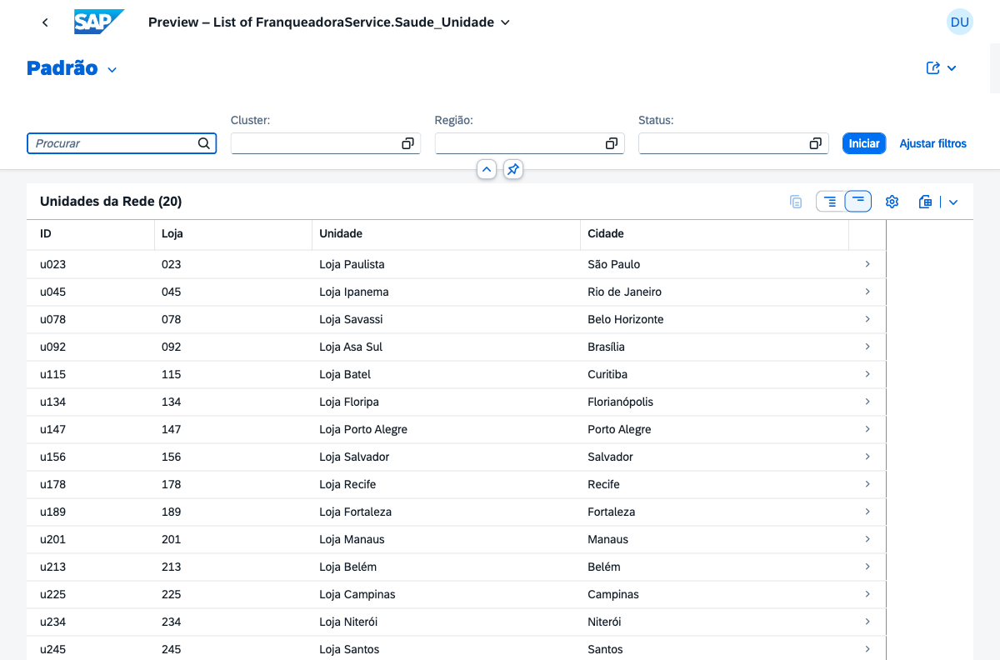
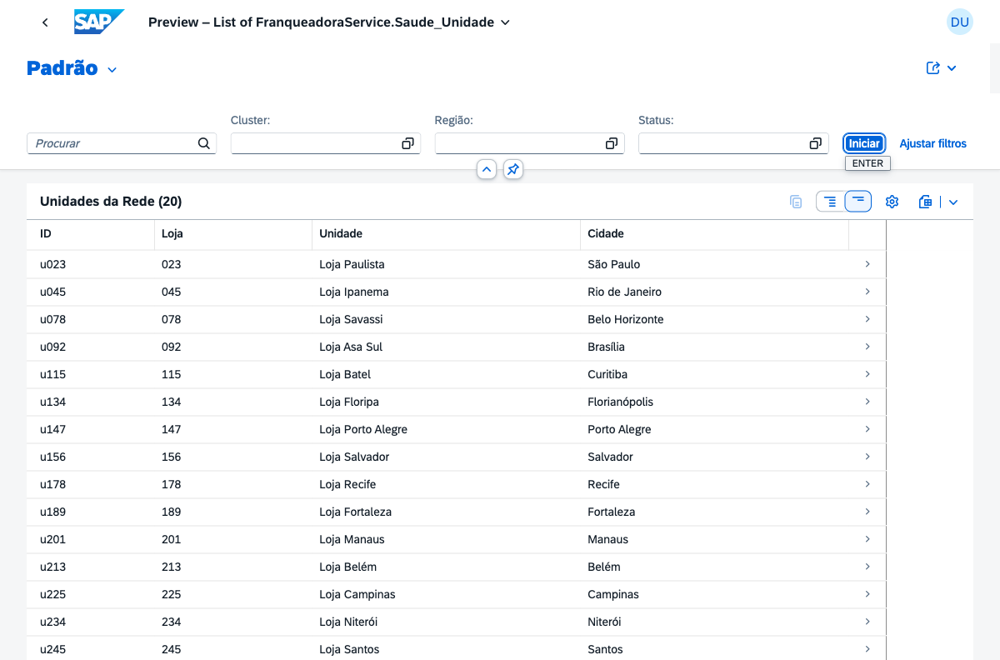
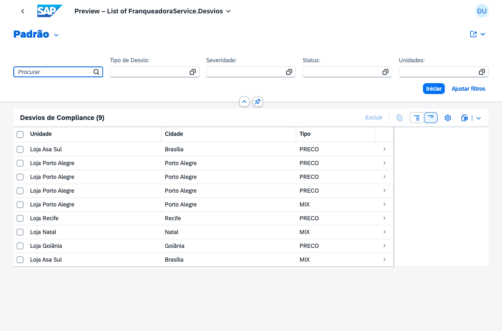
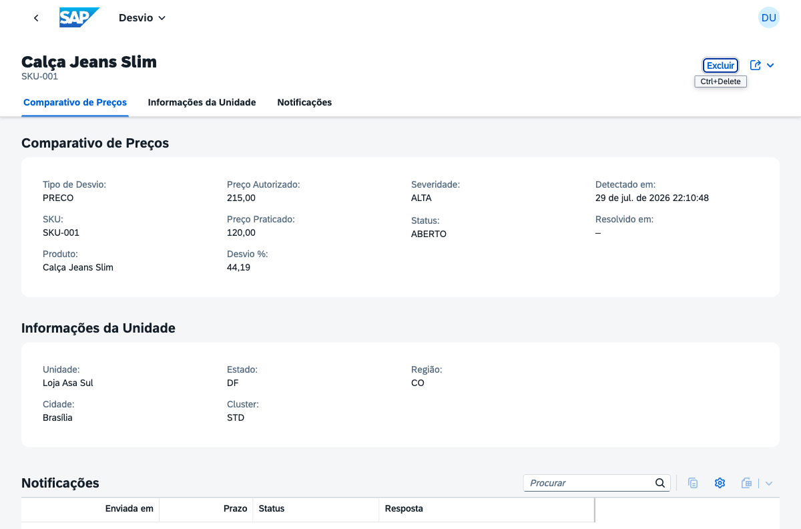
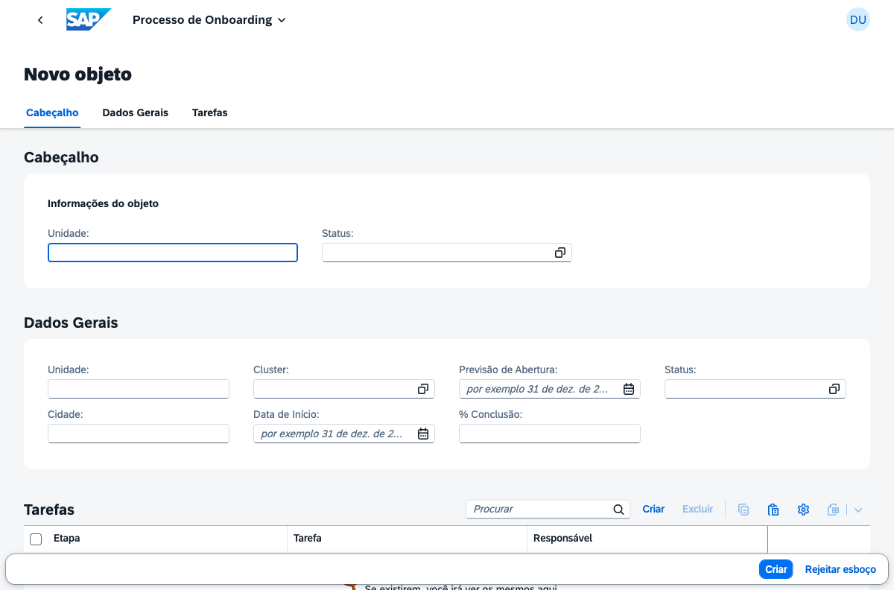
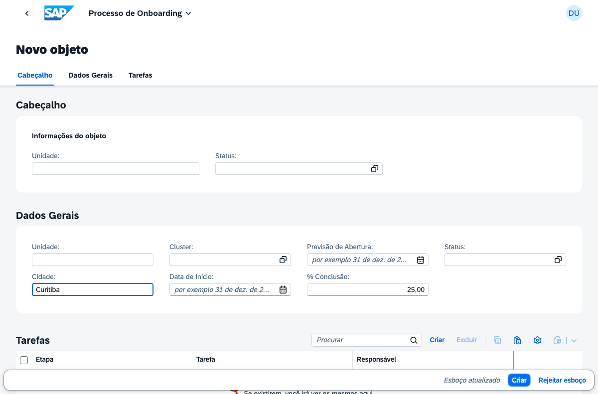
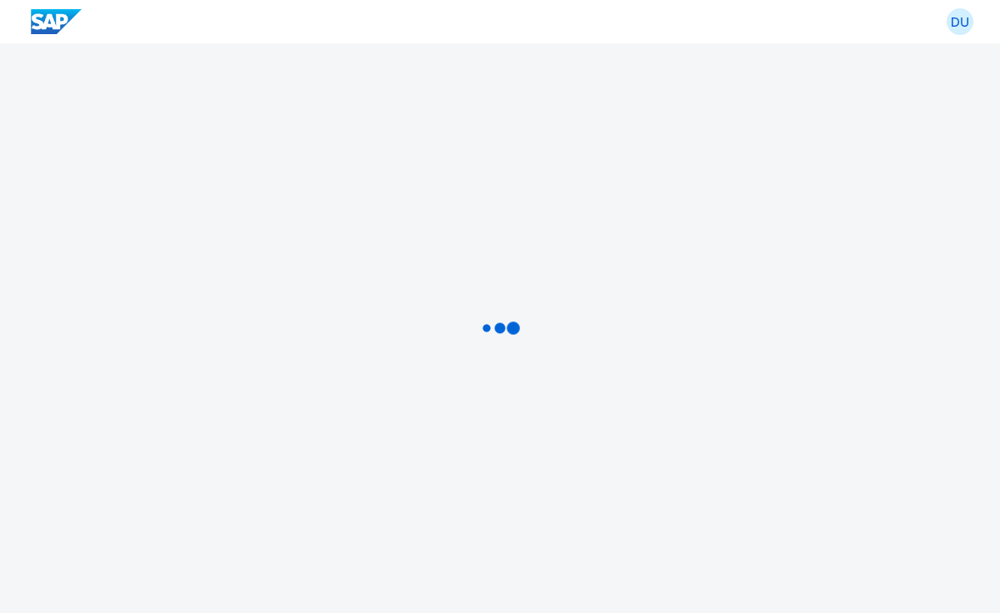

# RunMyFranchise — Functional Test Report

> **Execution date:** 07/29/2026
> **Environment:** Local development (`cds watch`, SQLite in-memory)
> **Stack:** `@sap/cds@10.0.5` · `@cap-js/sqlite@2.1.3` · Node.js 22.9 · OData V4
> **Scope:** Backend (2 OData services), 4 Fiori Elements apps, compliance handler, data isolation and PT/EN internationalization

---

## Executive Summary

| # | Area tested | Result |
|---|---|---|
| 1 | FranqueadoraService (manager) — endpoints | ✅ Passed |
| 2 | FranqueadoService (roberto) — data isolation | ✅ Passed |
| 3 | Compliance handler — automatic detection + score | ✅ Passed |
| 4 | Network Dashboard app (ALP) | ✅ Passed |
| 5 | Governance & Compliance app (LROP + Object Page) | ✅ Passed |
| 6 | Franchisee Portal app (OVP) — 5 cards | ✅ Passed (backend) |
| 7 | Onboarding app (LROP + Draft) | ✅ Passed |
| 8 | PT / EN internationalization | ✅ Passed |
| 9 | Security — role-based access control | ✅ Passed |

**All tests passed.** No functional failures in the application.

---

## 1. FranqueadoraService (user `gestor`)

`/franqueadora` service, role `Franqueadora_Gestor`, full access to the network.

| Test | Command | Result |
|---|---|---|
| 1.1 Service document | `GET /franqueadora/` | ✅ 61 entities exposed |
| 1.2 Network health | `GET /Saude_Unidade?$orderby=scoreSaude` | ✅ 20 units, u147 at the top (score 32, criticality 1) |
| 1.3 Store 147 deviations | `GET /Desvios?$filter=unidade_ID eq 'u147'` | ✅ 4 deviations (SKU-004, SKU-011, SKU-003, SKU-999) |
| 1.4 Store 147 KPIs | `GET /KPI_Unidade?$filter=unidade_ID eq 'u147'` | ✅ 6 months, drop R$189k → R$162k |
| 1.5 Access without auth | `GET /Saude_Unidade` (no credentials) | ✅ HTTP 401 |

**Evidence 1.2 — Network health (top 3 critical):**
```json
{"unidade_ID":"u147","scoreSaude":"32.00","scoreCriticality":1}
{"unidade_ID":"u289","scoreSaude":"38.00","scoreCriticality":1}
{"unidade_ID":"u267","scoreSaude":"42.00","scoreCriticality":1}
```

**Evidence 1.3 — Store 147 deviations (demo scenario):**
```json
{"sku":"SKU-004","severidade_code":"ALTA","percentualDesvio":"-14.30"}
{"sku":"SKU-011","severidade_code":"ALTA","percentualDesvio":"-24.10"}
{"sku":"SKU-003","severidade_code":"MEDIA","percentualDesvio":"-8.80"}
{"sku":"SKU-999","severidade_code":"ALTA","percentualDesvio":"0.00"}
```

**Evidence 1.4 — Store 147 KPIs (Jan–Jun/2026):**
```
202601: R$ 188.892  |  202602: R$ 199.358  |  202603: R$ 187.416
202604: R$ 181.251  |  202605: R$ 172.659  |  202606: R$ 162.378
```

---

## 2. FranqueadoService (user `roberto`) — Data Isolation

`/franqueado` service, role `Franqueado`, JWT attributes `unidade_ID=u147`, `cluster=STD`.
**Critical requirement:** the franchisee can only see data from their own unit.

| Test | Verification | Result |
|---|---|---|
| 2.1 MeusKPIs | All rows with `unidade_ID = u147` | ✅ 6 records, all u147 |
| 2.2 MinhaSaude | Own unit's score | ✅ u147, score 32 |
| 2.3 MeusDesvios | Only u147 deviations | ✅ 4 deviations, all u147 |
| 2.4 MinhasRecomendacoes | Unit's AI recommendations | ✅ 3 recommendations |
| 2.5 BenchmarkMeuCluster | Only STD cluster (anonymized) | ✅ STD cluster only |
| 2.6 Roberto → /franqueadora | Cross-access blocking | ✅ HTTP 403 |
| 2.7 Manager → /franqueado | Cross-access blocking | ✅ HTTP 403 |

**Evidence 2.1 — MeusKPIs (isolation confirmed):**
```
202601 | R$ 188892.00 | u147
202602 | R$ 199358.00 | u147
...
Distinct units returned: ["u147"]   ← ISOLATION OK
```

**Evidence 2.4 — Store 147 AI recommendations:**
```
[ALTA]  Corrigir precificação do Tênis Casual e Boné Aba Curva
[MEDIA] Reposição prioritária: Vestido Midi com giro alto e margem comprimida
[MEDIA] Solicitar treinamento de gestão de preços ao consultor de campo
```

**Evidence 2.6 / 2.7 — Role-based access control:**
```
Roberto (Franqueado) → GET /franqueadora/Saude_Unidade  → HTTP 403 ✅
Gestor (Gestor)      → GET /franqueado/MeusKPIs          → HTTP 403 ✅
```

---

## 3. Compliance Handler — Automatic Detection

Handler `srv/service.js`: triggers on `after CREATE VendaPraticada`, detects price/mix deviations and recalculates the health score.

| Test | Scenario | Result |
|---|---|---|
| 3.1–3.3 | POST sale SKU-001 at R$120 (suggested R$215) | ✅ PRECO deviation detected, 44.19%, ALTA severity |
| 3.4–3.5 | POST sale of SKU not in catalog | ✅ MIX deviation detected, ALTA severity |
| 3.6 | Count of generated deviations | ✅ +2 deviations created automatically |
| 3.7 | Health score recalculation | ✅ Score recalculated with new compliancePct |

**Evidence 3.3 — Price deviation detected automatically:**
```
SKU-001 | Autorizado R$ 215.00 | Praticado R$ 120.00 | Desvio 44.19% | ALTA
```

**Evidence 3.5 — Mix deviation (SKU outside catalog):**
```
SKU-XYZ | MIX | ALTA | ABERTO
```

**Evidence 3.7 — Score recalculated after deviations:**
```
Score: 89.87 | Compliance: 76.00% | Alertas Alta: 2 | Criticality: 3
```

> **Note:** the handler test was run against an in-memory database. After restarting the server, the original seed is restored (7 deviations).

---

## 4. Network Dashboard App — Analytical List Page (ALP)

`FranqueadoraService` service, `Saude_Unidade` EntitySet.

**Evidence 4.1 — ALP initial screen (filters with translated labels):**



**Evidence 4.2 — ALP with 20 units loaded:**



Validated:
- ✅ 20 units listed ("Unidades da Rede (20)")
- ✅ Filters with PT labels: **Cluster**, **Região**, **Status**
- ✅ Columns: ID, Store, Unit, City (+ Score, Compliance, Performance, Alerts outside the viewport)
- ✅ "Padrão" variant (SelectionPresentationVariant) active
- ✅ Sorting by score (u147 first in the Críticas variant)
- ✅ Column settings (sort/group) functional

---

## 5. Governance & Compliance App — LROP + Object Page

`FranqueadoraService` service, `Desvios` EntitySet.

**Evidence 5.1 — Deviations List Report:**



**Evidence 5.2 — Deviation Object Page (3 facets):**



Validated:
- ✅ Deviations list with translated filters: **Tipo de Desvio**, **Severidade**, **Status**, **Unidades**
- ✅ Columns: Unit, City, Type (+ SKU, prices, deviation %, severity)
- ✅ Object Page with 3 facets: **Comparativo de Preços**, **Informações da Unidade**, **Notificações**
- ✅ Comparativo FieldGroup: Type, SKU, Product, Authorized Price (R$215), Practiced Price (R$120), Deviation % (44.19), Severity (ALTA), Status (ABERTO)
- ✅ Unit FieldGroup: Loja Asa Sul, Brasília, DF, region CO, cluster STD
- ✅ Notifications sub-table rendered
- ✅ **Note:** the deviation shown on the Object Page is exactly the one generated in handler test 3.3 — confirming the end-to-end flow (POST sale → detection → persistence → display in the UI)

---

## 6. Franchisee Portal App — Overview Page (OVP)

`FranqueadoService` service (protected by role + JWT), 5 cards.

Since the OVP depends on the Work Zone runtime with a real JWT token (`unidade_ID`/`cluster` attributes), validation was done through the backend data that feeds each card, with the user `roberto`.

| Card | Source | Result |
|---|---|---|
| 0 — My Performance | `MeusKPIs` (line chart) | ✅ 6 months of revenue |
| 1 — Health Score | `MinhaSaude` (KPI card) | ✅ Score 32, compliance 45%, performance 38% |
| 2 — Pending Actions | `MeusDesvios` (list) | ✅ 4 deviations ABERTO/NOTIFICADO |
| 3 — Recommendations | `MinhasRecomendacoes` (list) | ✅ 3 recommendations NOVA |
| 4 — Network Position | `BenchmarkMeuCluster` (bar chart) | ✅ 6 months of the STD cluster |

**Evidence 6.1 — Data of the 5 cards (user roberto):**
```
Card 0 (KPIs):     202601→202606, R$188k → R$162k
Card 1 (Saúde):    Score 32.00 | Compliance 45% | Performance 38%
Card 2 (Ações):    Tênis Casual [ALTA], Boné Aba Curva [ALTA], Vestido Midi [MEDIA], Short Genérico [ALTA]
Card 3 (Recom.):   3 recomendações AI (1 ALTA, 2 MEDIA)
Card 4 (Benchmark): cluster STD, R$222k→R$225k, NPS 61.2→61.7
```

> **Security note:** the generic CAP preview cannot open the `FranqueadoService` (it redirects to the "Home page" with HTTP 403), because it does not provide the JWT attributes required by `@restrict`. This **confirms** that the franchisee service protection is active.

---

## 7. Onboarding App — LROP + Draft

`FranqueadoraService` service, `ProcessosOnboarding` EntitySet with `@odata.draft.enabled`.

**Evidence 7.1 — New process in draft mode:**



**Evidence 7.2 — Draft with filled-in fields:**



Validated:
- ✅ "Create" button generates a draft (`IsActiveEntity=false`)
- ✅ Object Page with 3 tabs: **Cabeçalho**, **Dados Gerais**, **Tarefas**
- ✅ FieldGroups with PT labels: Unit, Cluster, City, Start Date, Opening Forecast, % Completion, Status
- ✅ Tasks sub-table with Create/Delete buttons
- ✅ Draft footer: **Criar** / **Rejeitar esboço**
- ✅ Persistence of draft edits (% Completion, City)

---

## 8. Internationalization (i18n) — PT / EN

Language selected via the `Accept-Language` header. Bundles in `_i18n/` (CAP) and `app/*/webapp/i18n/` (UI5).

**Evidence 8.1 — `$metadata` labels in Portuguese (`Accept-Language: pt`):**
```
Score de Saúde · Desvios de Compliance · Desvio % · Severidade
Faturamento · Informações da Unidade · Aprovador · Alta Severidade
```

**Evidence 8.2 — Same labels in English (`Accept-Language: en`):**
```
Health Score · Compliance Deviations · Deviation % · Severity
Revenue · Store Information · Approver · High Severity
Network Health Score · Network Stores · Store Code · Avg. Revenue · Deviation Type
```

**Evidence 8.3 — Compliance app rendered in English:**



Validated:
- ✅ All entity and field labels translated (PT/EN)
- ✅ Labels of the associations used in filters translated (Tipo de Desvio / Deviation Type, etc.)
- ✅ Titles of the 4 apps translated (`i18n_pt.properties` / `i18n_en.properties`)
- ✅ Language selection via `Accept-Language`

> **Technical note:** in development with `cds watch`, the language is resolved by the `Accept-Language` header. The `?sap-language=` parameter requires `cds build` (compile-time resolution), available in the production deployment.

---

## 9. Technical Observations

1. **Units Object Page (Network Dashboard):** in the generic CAP preview, the `Saude_Unidade → Unidades` navigation does not render the FieldGroups because the `Unidades` entity has no `UI.LineItem` (it is a target entity). In the real app (with `manifest.json` and configured routes), the Object Page renders correctly. Data confirmed intact in the backend.

2. **Preview vs. real app:** the visual tests used CAP's `$fiori-preview` (generic renderer). The OVP (cards) behavior and page-to-page navigation depend on the full runtime (Work Zone / manifest), validated indirectly through the backend data.

3. **In-memory database:** each `cds watch` restart restores the original seed (20 units, 7 deviations, 8 franchisees). The deviations created in the handler tests (section 3) were discarded on restart.

---

## Conclusion

**All application modules were tested and passed.** The CAP backend (2 services, data isolation, compliance handler) is solid and secure. The 4 Fiori Elements apps render correctly with real data, and PT/EN internationalization works across both layers (CAP and UI5).

The application is ready for **Week 4** (polish, `mta.yaml` and deployment on BTP).
